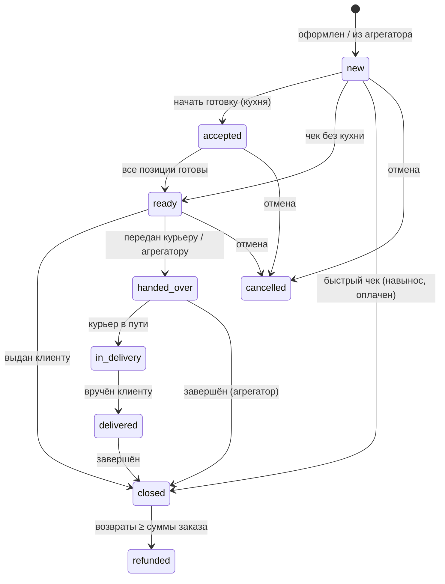

> [!info] Кратко
> «Заказы» — центральный домен продаж НИРБИ ERP. Он хранит каждый заказ от оформления на кассе до закрытия, ведёт возвраты и считает сводки продаж (X/Z-отчёты, выгрузка в 1С). Здесь же «живёт» кассовая смена — без открытой смены продажа невозможна.

## Назначение

Домен отвечает за всё, что происходит с заказом от момента оформления до расчётов по итогам:

- **Жизненный цикл заказа** — создание, наполнение корзины, оплата, готовка (кухня/KDS), выдача, доставка, закрытие, отмена.
- **Позиции и суммы** — что и по какой цене продано, с модификаторами и скидками; итоговая сумма заказа.
- **Фиксация оплаты** — домен не проводит платёж сам, а записывает **факт** оплаты (способ, сумма, реквизиты чека), который приходит с кассы или от партнёра [[PayKeeper]].
- **Возвраты** — полные и частичные, инициированные кассиром на кассе или менеджером из [[Админка|админки]].
- **Агрегация продаж** — выручка по сменам, разбивка по способам оплаты, топ товаров, суточные сводки и выгрузки для 1С.
- **Кассовая смена** — домен является «домом» смены (см. [[POS Desktop]]): открытие/закрытие, лимит 24 часа, привязка заказов к смене для Z-отчёта.

Заказ может прийти из двух источников: **внутренний канал** (касса [[POS Desktop]]) и **внешние агрегаторы доставки** (например, Яндекс Еда) — у них отдельный набор шагов приёма и передачи.

## Ключевые сущности

| Сущность | Что это | Ключевые атрибуты (бизнес-смысл) |
|----------|---------|-----------------------------------|
| **Заказ** | Единица продажи, привязана к торговой точке | Номер (сквозной за день по точке), тип, статус, канал, сумма, способ и факт оплаты, привязка к клиенту и смене |
| **Позиция заказа** | Один проданный товар в заказе | Название, количество, цена за единицу, сумма строки, скидка строки, НДС, комментарий («без лука») |
| **Модификатор** | Опция/добавка к позиции | Группа, вариант, цена — копируются в позицию в момент продажи |
| **Запись возврата** | Проведённый (фактический) возврат по заказу | Сумма, способ, признак «полный/частичный», статус исполнения, кассир |
| **Запрос на возврат** | Заявка на возврат из админки, ждёт подтверждения на кассе | Сумма, причина, статус (ожидает/подтверждён/отклонён), кто запросил и кто подтвердил |
| **Кассовая смена** | Фискальная смена конкретной кассы | Статус (открыта/закрыта/принудительно закрыта), время открытия, итоги продаж и возвратов |

**Тип заказа** влияет на сценарий обслуживания:

| Тип | Смысл | Особенность |
|-----|-------|-------------|
| Навынос (`takeaway`) | Заказ «с собой» через прилавок | Оплаченный чек без кухни закрывается сразу (быстрый чек) |
| В зале (`dine_in`) | Обслуживание за столом | Привязка к столу и официанту; стол занимается на время визита |
| Доставка (`delivery`) | Заказ с доставкой курьером | Проходит полный flow с передачей курьеру и подтверждением вручения |

**Канал** — откуда пришёл заказ: внутренний (касса) или внешний агрегатор доставки. У агрегаторских заказов свой порядок приёма/готовности/передачи, и они не привязаны к кассовой смене.

> [!note] Номер заказа
> Нумерация — «per-store per-day»: для каждой торговой точки нумерация начинается заново каждый день («001», «002», …). Это удобный человекочитаемый номер для чека и общения с гостем, а не глобальный идентификатор.

> [!note] Как считается сумма
> Итоговая сумма заказа — это **сумма строк** (количество × цена за единицу). Скидку касса уже учла в ценах позиций, поэтому сумма скидки хранится как **справочная информация** (для отчётов и отображения) и повторно из итога **не вычитается**. Суммы в домене ведутся в рублях; если касса или партнёр присылают значения в копейках, они конвертируются на приёме.

## Статусная модель заказа

Заказ проходит по статусам в зависимости от типа (навынос / в зале / доставка) и наличия кухонных позиций. Ниже — статусы, реально используемые в коде.

| Статус | Что означает | Как в него попадают |
|--------|--------------|---------------------|
| `new` | Создан; набирается корзина или ждёт кухню | Оформление на кассе / приём из агрегатора |
| `accepted` | Принят в готовку (повар начал) | «Начать готовку» — для заказов с кухонными позициями (KDS) |
| `ready` | Готов к выдаче | Все позиции готовы (KDS) **или** чек без кухни |
| `handed_over` | Передан курьеру / агрегатору | Ручной шаг в flow доставки и агрегатора |
| `in_delivery` | Курьер в пути | Начало доставки |
| `delivered` | Вручён клиенту | Подтверждение доставки |
| `closed` | Завершён — выдан и оплачен | Быстрый чек навынос или завершение после выдачи |
| `cancelled` | Отменён | Отмена из `new` / `accepted` / `ready` с указанием причины |
| `refunded` | Полностью возвращён | Сумма проведённых возвратов достигла суммы заказа |

**Два основных сценария:**

- **Короткий (быстрый чек)** — навынос без кухни и уже оплаченный: `new → closed` за один шаг. Так работает большинство продаж «через прилавок».
- **Полный** — с кухней/доставкой: `new → accepted → ready → …→ closed`. Кухонные позиции проходят через экран повара (KDS), заказ становится `ready` автоматически, когда готовы все позиции.

> [!important] Правило закрытия
> Заказ переходит в `closed` только если **зафиксирована оплата**. Отмена после закрытия невозможна — деньги возвращаются уже через механизм возврата (см. ниже). Позиции можно добавлять и удалять только пока заказ в статусе `new`.

> [!important] Продажа только при открытой смене
> Оформить чек на кассе можно, лишь когда у кассы есть **открытая и не просроченная** (менее 24 часов) кассовая смена. Иначе продажа блокируется — это требование фискального законодательства (54-ФЗ).

> [!warning] Расхождение спека↔код
> Текстовое перечисление статусов в модели данных дополнительно упоминает `in_progress` (легаси) и `rejected` как статусы заказа. В коде (срез `3f6879c`) заказ этих статусов **не принимает** — используются только девять из таблицы выше, и ограничение базы данных их тоже не включает. `rejected` встречается лишь как статус *запроса на возврат* (не заказа). При обновлении спеки фантомные статусы из перечисления стоит убрать.

## Возвраты и рефанды

Возврат всегда идёт **по оплаченному заказу** и не может превышать его сумму. Есть два пути инициации.

**1. Возврат на кассе (инициирует кассир).** Кассир проводит возврат прямо на терминале — сразу с фискальным чеком возврата. Такой возврат идемпотентен (повторная отправка одного и того же возврата не создаёт дубль).

**2. Возврат из админки (инициирует менеджер).** Менеджер создаёт **запрос на возврат** в [[Админка|админке]] с суммой и причиной. Запрос ждёт, пока кассир **физически подтвердит** его на кассе (тогда создаётся фактическая запись возврата) либо **отклонит**.

| Поток | Статусы | Смысл |
|-------|---------|-------|
| Запрос на возврат (админка) | `ожидает → подтверждён` / `отклонён` | Заявка менеджера, судьбу решает касса |
| Запись возврата (факт) | `начат → выполнен` / `ошибка` | Фактический возврат; «начат» — пока терминал/партнёр не подтвердил |

**Бизнес-правила (подтверждены кодом):**

- **Только по оплаченному заказу** — на неоплаченный заказ возврат невозможен.
- **Лимит по сумме** — сумма всех проведённых и ожидающих возвратов плюс новый не может превысить сумму заказа.
- **Лимит по позициям** — при частичном возврате нельзя вернуть больше единиц конкретной позиции, чем было продано (защита от повторного возврата одной и той же строки, даже когда по сумме заказа ещё есть «запас»).
- **Частичный возврат картой/онлайн** — требует список возвращаемых позиций (корзину), чтобы партнёр [[PayKeeper]] сформировал корректный фискальный чек возврата (54-ФЗ).
- **Полный возврат** — когда сумма выполненных возвратов достигает суммы заказа, заказ переходит в `refunded`.

> [!note] Наличные и безнал закрываются по-разному
> Возврат наличными фиксируется как выполненный сразу. Возврат по карте/СБП (через терминал или онлайн у PayKeeper) сначала помечается как «начат» и становится «выполнен» только после подтверждения от терминала/партнёра — до этого заказ не считается возвращённым. Это исключает «фантомные» возвраты при отказе оплаты.

## Агрегация продаж

Домен считает продажи для отчётности и сверки касс.

- **Отчёт по смене (X/Z-отчёт).** Сводка за период по торговой точке (и опционально по сотруднику): общая выручка, разбивка по способам оплаты (наличные / карта / СБП; неизвестный способ относится к «карте»), число заказов, число отмен, сумма скидок, **сумма возвратов** и средний чек, а также топ-10 товаров. Считается по дате оплаты. Есть режим «текущей смены» — итоги по открытой смене без ручного указания границ периода (устраняет расхождение часовых поясов между кассой и сервером).
- **Суточная сводка и сверка с PayKeeper.** Разбивка по дням «наличные / карта / СБП» в виде **нетто** (продажи минус выполненные возвраты) — используется для сверки итогов ERP с данными платёжного партнёра.
- **Выгрузка в 1С.** Итоги продаж по номенклатуре в табличном файле (Excel) и в виде агрегата — для загрузки в 1С.

> [!note] Привязка заказов к смене
> Каждый заказ, оформленный на кассе, привязывается к кассовой смене. Именно по этой привязке собирается Z-отчёт и аналитика «по смене». Заказы из агрегаторов и старые записи к смене не привязаны.

> [!note] Кассовая смена — устройство-ориентированная модель
> Смена перестраивается из «программной» в **устройство-ориентированную**: итоги сверяются по трём источникам (касса, банковский терминал Р8, фискальный накопитель), формируются X/Z-отчёты по каждому устройству, а расхождения журналируются. Подробности процесса и экраны — в домене [[POS Desktop]]. Оборудование подключается через [[POS Bridge]], отчётность для ОФД — через [[OFD]].

## Роли и доступ

Доступ определяется не «жёсткой ролью», а **правами** сотрудника и его **scope** (какие точки он видит). Подробно — в [[Роли и доступ]].

| Действие | Кто выполняет |
|----------|---------------|
| Просмотр заказов | По scope: владелец франшизы — по всем точкам; франчайзи — по своим; сотрудник — по назначенным точкам |
| Оформление и оплата заказа на кассе | Сотрудник с доступом к POS на своей точке |
| Отмена заказа | В рамках scope (кассир — как правило свой заказ, менеджер/владелец — шире) |
| Возврат на кассе | Кассир с доступом к POS |
| Запрос возврата из админки | Менеджер / владелец в рамках scope; подтверждение — кассир на кассе |
| Отчёты и выгрузки | Сотрудник с правом на чтение заказов/отчётности |

> [!warning] Открытый вопрос: точный маппинг прав
> Какое именно право требуется для каждого действия домена, ещё требует финальной сверки с общим каталогом прав. Это зафиксировано как открытый вопрос в спецификации сервиса.

## Связи с другими доменами

| Домен | Характер связи |
|-------|----------------|
| [[Каталог]] | Товары, цены, ставки НДС и кухонные станции — копируются («замораживаются») в позицию в момент продажи, чтобы заказ не менялся при правках каталога |
| [[Склад]] | По факту завершения заказа запускается списание ингредиентов по техкартам |
| [[Клиенты]] | Заказ можно привязать к клиенту (CRM); заказ может быть и анонимным |
| [[Лояльность]] | Начисления и списания бонусов/штампов происходят при оплате на кассе |
| [[PayKeeper]] | Партнёр по фискализации и эквайрингу: присылает подтверждения оплаты, возврата и данные чека |
| [[POS Desktop]] | Касса — основной источник заказов и место ведения кассовой смены |
| [[POS Bridge]] | Драйвер кассового оборудования (фискальный регистратор, банковский терминал) на точке |
| [[OFD]] | Отчётность оператору фискальных данных |
| [[Админка]] | Просмотр заказов, запросы на возврат, отчёты и выгрузки |

## Ограничения и открытые вопросы

- **Домен не проводит платёж** — только фиксирует его результат. Реальное списание денег и фискализация — на стороне кассы, [[PayKeeper]] и оборудования [[POS Bridge]].
- **Точный маппинг прав** на действия домена ещё требует сверки с каталогом прав (см. выше).
- **Формат единиц в отчёте по смене** — суммы отдаются в рублях, тогда как касса работает в копейках; на клиенте живёт пересчёт. В бэклоге — унифицировать единицы либо явно зафиксировать договорённость.
- **Формат выгрузки в 1С** описан пока только в коде — не вынесен в отдельную бизнес-спецификацию.
- **Устройство-ориентированная смена** дорабатывается поэтапно; часть сценариев сверки и отчётов по устройствам — в процессе (см. [[POS Desktop]]).

Общий контекст платформы — [[Обзор]] и [[Карта платформы]]. Термины — [[Глоссарий]].

---
> [!note] Сверено с кодом
> `erp-order-service` · ветка `feature/cash-shift-device` · срез `3f6879c` (2026-07-07). Статусная модель, правила возвратов (лимиты по сумме и по позициям, идемпотентность, полный→`refunded`), гарды кассовой смены и логика агрегации продаж соответствуют коду. Единственное расхождение — фантомные статусы `in_progress`/`rejected` в текстовом перечислении модели данных (в коде и ограничении БД их нет); отражено в callout выше.
