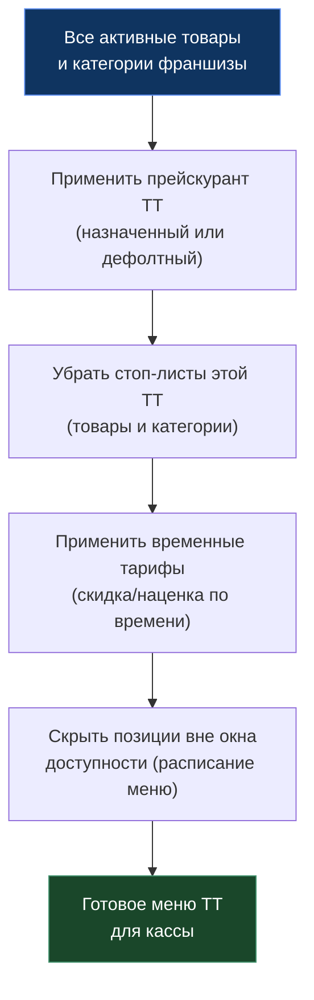

> [!info] Кратко
> Каталог — это ассортимент франшизы: товары и их категории, модификаторы (варианты и добавки), а также цены (прейскуранты) и стоп-листы. Каталог един для всей франшизы, а вот **цена** и **доступность** позиции зависят от конкретной торговой точки (ТТ). Именно каталог собирает готовое «меню» для кассы и синхронизирует ассортимент в [[PayKeeper]].

## Назначение

Домен отвечает за то, **что продаётся** и **почём**:

- **Справочник товаров и категорий** франшизы — единый на все ТТ.
- **Модификаторы** — как товар можно кастомизировать при заказе (размер, молоко, добавки).
- **Прейскуранты** — наборы цен; одна и та же позиция может стоить по-разному в разных ТТ.
- **Стоп-листы** — временная блокировка позиции от продажи на конкретной ТТ.
- **Вычисляемое меню ТТ** — итоговая выдача для кассы: активные товары + актуальная цена − стоп-лист.
- **Синхронизация в [[PayKeeper]]** — ассортимент автоматически уезжает в личный кабинет партнёра-кассы.

> [!note] Каталог не хранит остатки и рецептуры
> Сколько ингредиентов уходит на блюдо (техкарты) и складские остатки — это [[Склад]]. Каталог знает только состав меню и цены. Ингредиенты как отдельная сущность живут в [[Склад]], а не в каталоге.

Изменения в каталоге применяются **мгновенно** — версионирования (черновик → публикация) нет. Отредактировали цену или состав — новое значение сразу видно на кассе.

## Ключевые сущности

### Товар

Позиция ассортимента. Бывает двух типов:

| Тип | Что это | Пример |
|-----|---------|--------|
| **Блюдо** (`dish`) | Готовится/собирается, может иметь модификаторы-варианты | Пицца, латте, бургер |
| **Продукт** (`good`) | Готовый штучный товар | Вода, шоколадка |

Ключевые правила и атрибуты:

- **Название уникально** в рамках франшизы (среди неудалённых товаров).
- **Категория необязательна** — товар без категории попадает в «Без категории».
- **Мягкое удаление** — удалённый товар скрывается, но не стирается (сохраняется история заказов); его можно **восстановить** (при восстановлении имя снова проверяется на уникальность).
- **Цены на товаре нет** — цена определяется прейскурантом (см. ниже).
- **Доступность по ТТ**: по умолчанию товар доступен во всех ТТ; можно ограничить списком конкретных ТТ (тогда список обязателен — нельзя «спрятать везде»).

**Технологические флаги** (влияют на поведение кассы):

| Флаг | Что делает на кассе |
|------|---------------------|
| Свободная цена | Цену вводит кассир вручную (товар без фикс-цены) |
| Продажа на вес | Позиция продаётся по весу |
| Только администратор | Позицию видит/пробивает только администратор |
| Запрет ручной скидки | На товар нельзя применить ручную скидку |
| Исключён из акций | Товар не участвует в промо-скидке (но общая скидка на чек его затрагивает) |
| Промо-скидка (ставка %) | Фикс-ставка targeted-скидки; сумму считает касса, базовая цена не снижается |
| Алкоголь / Табак / Сахаросодержащий | Маркеры для ограничений продажи и учёта |
| Маркированный товар | Требует сканирования кода DataMatrix (Честный Знак) на кассе |
| Требует кухни + станция | Позиция уходит на приготовление, маршрутизируется на кухонную станцию (см. [[Заказы]]) |

Также товар хранит вес, КБЖУ, штрихкод, коды для интеграций (артикул для [[PayKeeper]] и код номенклатуры 1С), и фискальные атрибуты 54-ФЗ (ставка НДС, предмет и способ расчёта) — нужны для чека.

### Категория

Раздел меню. Категории образуют **дерево** (у категории может быть родитель).

- **Удалить категорию нельзя**, если у неё есть подкатегории или привязанные товары — сначала перенести/убрать их.
- Категория хранит порядок и способ сортировки товаров, цвет плитки для кассы и флаги доступности по каналам (мобильное приложение, сайт, агрегаторы).

## Модификаторы

Модификатор позволяет кастомизировать товар при заказе: выбрать размер, добавить сироп, убрать лук. **Группа модификаторов** — самостоятельный элемент справочника; создаётся один раз и переиспользуется между товарами.

- **Группа**: название, тип (`групповой` — выбор из опций / `простой`), минимум и максимум выбираемых опций.
- **Опция**: название, мин/макс/по-умолчанию количество, бесплатное количество, порядок, признак активности.
- **Цена опции — из прейскуранта**, а не на самой опции (доплата к цене товара).

### Два типа привязки к товару

При привязке группы к товару задаётся **тип привязки**. Одна и та же группа может быть закреплённой для одного товара и свободной для другого.

| | Закреплённый (`structural`) | Свободный (`free`) |
|---|---|---|
| Смысл | **Вариант блюда** — без выбора товар не существует | **Опциональная добавка** — клиент может взять или нет |
| Обязательность | Всегда обязателен (нужно выбрать ≥1) | Необязателен |
| Примеры | Размер пиццы, объём напитка, вид теста | Доп. сыр, сироп, соус |

**Правила закреплённого модификатора** (подтверждено в коде):

- **Максимум один** закреплённый модификатор на товар.
- **Только для блюд** (`dish`), не для штучных продуктов.
- **Создаётся только как новый** прямо из карточки товара — нельзя закрепить уже существующую группу из справочника. Свободные же модификаторы привязываются из справочника и переиспользуются.
- Если франшиза работает с 1С — **у каждой опции закреплённого модификатора обязателен код номенклатуры 1С** (каждая вариация = отдельная позиция в 1С). Без кода сохранить нельзя.
- **Открепление закреплённого модификатора удаляет саму группу** (она принадлежит товару, а не общему справочнику).

Для свободных модификаторов при привязке можно **переопределить мин/макс** под конкретный товар, не меняя настройки группы (например, «Добавки» глобально до 3, а для бургера — до 2).

## Стоп-листы

Стоп-лист — механизм **временно скрыть позицию из продажи на конкретной ТТ**, не трогая каталог. Классический сценарий: «закончилась моцарелла — стопнули все пиццы с ней на этой точке».

| Что можно стопнуть | Эффект |
|--------------------|--------|
| **Товар** | Позиция исчезает из меню этой ТТ |
| **Категория** | Из меню ТТ исчезают **все** товары категории |

Правила:

- **Привязка к ТТ** — стоп на одной точке не влияет на другие; одну позицию можно независимо стопнуть на нескольких ТТ.
- **Приоритет: категория важнее товара** — если стопнута категория, скрываются все её товары, даже если по отдельности они не в стопе. Снятие стопа с категории вернёт товары, кроме тех, что стопнуты индивидуально.
- **Бессрочно** — действует, пока не снимут вручную (авто-снятия по времени или по остаткам склада пока нет).
- Можно указать **причину** остановки; система фиксирует, **кто** и **когда** остановил.

> [!note] Стоп-лист мгновенно долетает до кассы
> При постановке/снятии стопа каталог рассылает сигнал, который через POS-слой доходит до [[POS Desktop]] — касса показывает «Меню изменилось» и подтягивает свежий список. Ручного обновления не требуется.

## Прейскуранты и цены

> [!important] Цена живёт только в прейскуранте
> В самом каталоге цен нет — только состав меню. **Прейскурант** — это именованный набор цен на товары и опции модификаторов. Это позволяет держать разные цены для разных ТТ (например, «Стандарт» и «Аэропорт»).

Правила прейскурантов (подтверждено в коде):

- **Ровно один дефолтный** прейскурант на франшизу. Первый созданный автоматически становится дефолтным.
- **Дефолтный удалить нельзя** — сначала назначить дефолтным другой. **Нельзя и просто «снять» флаг дефолта** — его можно только передать другому прейскуранту.
- **Автозаполнение**: новый прейскурант сразу заполняется всеми активными товарами и опциями; цены копируются из дефолтного (а если дефолтного ещё нет — ставится 0). При добавлении нового товара/опции они попадают во все прейскуранты с ценой 0.
- **Назначение на ТТ**: одна ТТ → максимум один прейскурант; несколько ТТ могут делить один прейскурант. Если у ТТ прейскурант не назначен — применяется **дефолтный**. Само назначение прейскуранта на ТТ хранится на стороне [[Склад|торговых точек]] (Store).
- При **смене дефолтного** прейскуранта у всех товаров меняется цена — каталог автоматически перевыгружает их в [[PayKeeper]].

### Как собирается меню торговой точки

Касса не запрашивает товары, цены и стопы по отдельности — она получает **готовое меню одним запросом** (внутренний вызов из [[POS Desktop]] через POS-слой). Сборка идёт по шагам:

Нюансы выдачи:

- Если у ТТ нет прейскуранта и дефолтного тоже нет — товары вернутся **без цены** (`null`).
- Товар со **свободной ценой** всегда отдаётся без цены — кассир вводит её на терминале.
- Помимо цены и стопов, меню учитывает **временные тарифы** (скидка/наценка в определённые часы) и **окна доступности** (бизнес-ланч, завтраки — позиция видна только в своё время/дни). Эти расписания настраиваются на уровне франшизы.

## Роли и доступ

Доступ определяется набором прав (permissions) и областью видимости (scope) сотрудника — подробнее в [[Роли и доступ]]. На практике:

| Действие | Владелец франшизы | Владелец партнёра | Менеджер ТТ | Кассир (POS) |
|----------|:---:|:---:|:---:|:---:|
| Просмотр каталога, модификаторов, прейскурантов | Да | Свои ТТ | Своя ТТ | Видит готовое меню |
| Создание/правка товаров, категорий, модификаторов, цен | Да | Нет | Нет | Нет |
| Стоп-лист: остановить/снять | Любая ТТ | Свои ТТ | Своя ТТ | Нет (read-only) |

- Право на **редактирование каталога и цен** имеет по сути только владелец франшизы (scope на всю франшизу).
- Право на **стоп-листы** отделено — его можно выдать менеджеру ТТ в рамках его точек.
- Кассир каталог не редактирует: он работает с уже вычисленным меню на [[POS Desktop]].

## Связи с другими доменами

| Домен | Связь |
|-------|-------|
| [[POS Desktop]] | Получает вычисленное меню ТТ, показывает стоп-листы, отдаёт свободную цену кассиру |
| [[Заказы]] | Заказ ссылается на товары/опции каталога; кухонные станции задаются на товаре (флаг «требует кухни») |
| [[Склад]] | Хранит техкарты (рецептуры) и остатки по товарам/модификаторам; здесь же хранится назначение прейскуранта на ТТ |
| [[PayKeeper]] | Каталог односторонне выгружает товары и модификаторы в личный кабинет кассы-партнёра |
| [[Агрегаторы доставки]] | Каталог — источник для внешних меню (рекламный монитор, экспорт, будущие агрегаторы) |
| [[Админка]] | Весь каталог, прейскуранты, модификаторы и стоп-листы ведутся из админки франшизы |

> [!note] Синхронизация в PayKeeper — только «туда»
> При любом изменении товара, категории или группы модификаторов каталог надёжно (через механизм гарантированной доставки событий) передаёт изменение в адаптер [[PayKeeper]], который обновляет ассортимент в личном кабинете партнёра. У PayKeeper нет понятия «категория» — она передаётся как текстовый путь в названии («Кофе / Капучино»). Обратной синхронизации (из PayKeeper в каталог) нет. Подробнее — [[PayKeeper]].

## Ограничения и открытые вопросы

- **Стоп по остаткам склада** — авто-стоп, когда закончился ингредиент, пока не реализован (снятие/постановка только вручную).
- **Стоп по отдельным опциям модификатора и по расписанию** — не реализовано (только товар/категория, бессрочно).
- **Фото и КБЖУ** заведены в модели, но полноценная работа с изображениями (загрузка в хранилище) — следующая фаза.

> [!warning] Расхождение спеки и кода: версионирование прейскурантов
> Бизнес-спека прейскурантов описывает версионирование «черновик → публикация» совместно с каталогом. **В коде этого нет**: и каталог, и прейскуранты работают без версий, изменения применяются мгновенно (концепция версионирования каталога была упразднена). Раздел «Версионирование» в старой спеке следует считать неактуальным.

> [!warning] Расхождение спеки и кода: удаление назначенного прейскуранта
> Спека требует запрещать удаление прейскуранта, назначенного хотя бы на одну ТТ. **В текущем коде эта проверка пропущена** (MVP-упрощение, требует межсервисного запроса) — назначенный прейскурант технически можно удалить. Поведение стоит проверить и при необходимости завести задачу.

---
> [!note] Сверено с кодом
> `erp-catalog-service` · ветка `main` · срез `800a934` (2026-06-26). Сущности товаров/категорий/модификаторов, правила закреплённых модификаторов (один на товар, только блюда, только «новый», обязательный код 1С), приоритет «категория > товар» в стоп-листах, единственный/неудаляемый дефолтный прейскурант и автозаполнение цен — **подтверждены по коду**. Два расхождения со старой бизнес-спекой прейскурантов вынесены в предупреждения выше.

## Ссылки

- [[Обзор]]
- [[Глоссарий]]
- [[Роли и доступ]]
- [[Карта платформы]]
- [[Админка]]
- [[POS Desktop]]
- [[Заказы]]
- [[Склад]]
- [[Агрегаторы доставки]]
- [[PayKeeper]]
