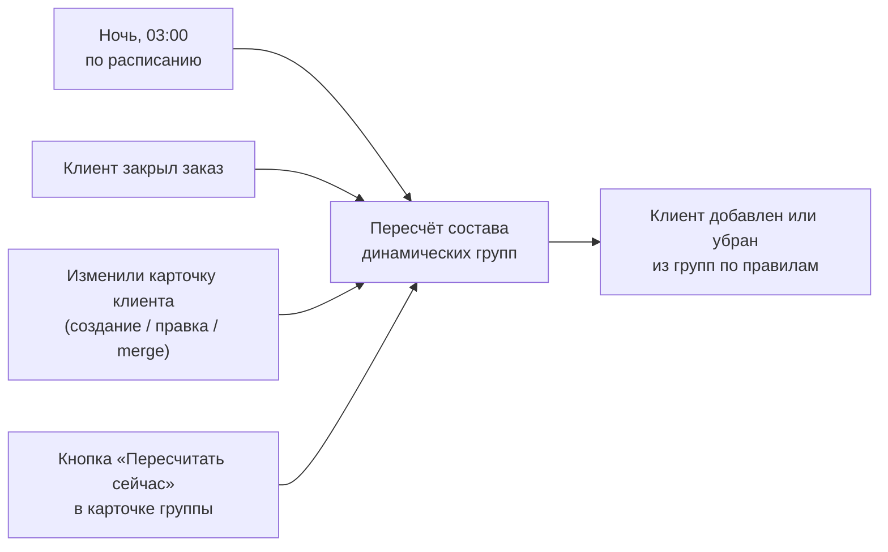

> [!info] Кратко
> Домен «Клиенты» — это CRM для гостей сети (не сотрудников). Он хранит карточки клиентов и их адреса доставки, объединяет клиентов в группы для сегментации (вручную или по правилам с ночным авто-пересчётом) и даёт кассиру завести клиента прямо на кассе за пару полей. На этот домен опираются [[Лояльность]] и [[Заказы]].

## Назначение

Клиент — это конечный покупатель сети, отдельная сущность, никак не связанная с сотрудниками. Один клиент принадлежит **строго одной франшизе**; между разными брендами клиенты не пересекаются (один и тот же человек в двух сетях — две независимые карточки).

Внутри франшизы действует **единый пул клиентов**: владелец бренда и все партнёры-франчайзи видят всех клиентов франшизы (общая база лояльных гостей, а не «свои у каждого партнёра»).

Домен — фундамент для последующих продуктов: программы лояльности, скидок, промо-кампаний и рассылок. Сам по себе он клиента не «логинит» — регистрация гостя через сайт или мобильное приложение пока не поддержана, клиента заводит кассир или администратор.

## Ключевые сущности

### Клиент

| Данные | Обязательно | Пояснение для БА |
|--------|-------------|------------------|
| Имя | Да | Показывается в карточке, на будущих чеках и в рассылках |
| Фамилия | Нет | |
| Телефон | Да | **Главный ключ поиска.** Любой ввод (`8 999…`, `+7 (999)…`) приводится к единому формату `+7XXXXXXXXXX`. Уникален в рамках франшизы — двух активных клиентов с одним номером быть не может |
| Email | Нет | Приводится к нижнему регистру. **Без уникальности** — одну почту может делить семья |
| Дата рождения | Нет | Для промо «именинники ±N дней» и статистики |
| Пол | Нет | Мужской / женский / другое / не указан |
| Заметки | Нет | Свободный текст кассира или менеджера |
| Источник регистрации | Да | Откуда клиент попал в базу: касса (POS), админка, а также веб / мобильное / импорт (последние три — на будущее) |
| Кто завёл | Нет | Сотрудник, создавший запись, — для аудита |
| Согласие на обработку ПД | Нет | Отметка о согласии по ФЗ-152 (см. открытые вопросы) |
| Реферальный код | Авто | Пожизненный 6-символьный код, генерируется при создании. Подробнее — [[Лояльность]] |
| Кто пригласил | Нет | Ссылка на другого клиента-пригласителя. Ставится один раз и только до первого заказа |
| Дата первого заказа | Авто | Маркер «первый заказ состоялся» для реферальной механики |

> [!note] Удаление клиента = обезличивание (soft delete)
> Физически удалить клиента нельзя — за ним стоит история заказов и требования 54-ФЗ/152-ФЗ. При удалении карточка помечается удалённой, а персональные данные затираются: имя → «Удалён», телефон обезличивается (с сохранением уникальности), email/фамилия/дата рождения/заметки очищаются, адреса удаляются. Связь с прошлыми заказами **сохраняется** — история остаётся в аналитике, но уже анонимной. Это и есть «право на забвение».

### Адрес доставки

У клиента может быть несколько адресов (дом, работа, родителям). У каждого — город, улица, квартира, подъезд, этаж, код домофона, заметки курьеру и логическая привязка к зоне доставки торговой точки. **Ровно один** адрес помечается основным; при назначении нового основного прежний автоматически перестаёт им быть.

## Группы клиентов

Группы — инструмент **сегментации** (для будущих промо, скидок и рассылок). Одна группа принадлежит одной франшизе. Один клиент может состоять сразу в нескольких группах.

| Тип группы | Как формируется membership | Когда применять |
|------------|----------------------------|-----------------|
| **Статическая** | Администратор вручную добавляет и убирает клиентов | Списки без формального критерия: «VIP по личному приглашению», «Закрытый клуб» |
| **Динамическая** | Система сама пересчитывает состав по правилам | Измеримый критерий: «Чек > 5000 ₽», «Не были 60 дней», «Именинники декабря» |

В одной группе членство либо полностью ручное, либо полностью автоматическое — смешивать нельзя.

### Правила динамических групп

Администратор задаёт до **5 условий**, объединённых логикой **И** (клиент попадает в группу, только если выполнены все условия). Реально работающий каталог правил:

| Правило | Смысл |
|---------|-------|
| Сумма покупок за всё время | Совокупный оборот клиента (LTV) |
| Сумма покупок за период | Оборот за последние N дней |
| Дней с последнего заказа | Давность последней активности (для churn-групп) |
| День рождения | ДР попадает в окно ±N дней |
| Пол | Мужской / женский / … |
| Источник регистрации | Только POS-клиенты, только из админки и т.п. |

> [!warning] Не все правила из бизнес-спеки реально работают
> - Правила **«Город»** и **«Зона доставки»** система принимает, но фактически **не находит по ним ни одного клиента** — это заготовка на будущее (адрес пока не участвует в расчёте). Группа только с таким правилом будет пустой.
> - Правила из спеки **«Сумма покупок в диапазон дат»**, **«Включение групп»** и **«Исключение групп»** в коде пока отсутствуют.
> - Отложены (нет реализации): фильтр по баллам лояльности, по оценкам заказов, логика ИЛИ и вложенные условия.
>
> Для БА: при постановке сегментов опирайтесь на «работающий» список выше, а не на полный каталог из старой бизнес-спеки.

### Когда пересчитывается динамическая группа

- **Ночью (03:00)** — полный пересчёт всех динамических групп всех франшиз. Страховка на случай пропущенных событий.
- **При закрытии заказа клиента** — точечно пересчитывается только этот клиент (через событие о завершении заказа из домена [[Заказы]]).
- **При изменении карточки клиента** — пересчёт для него запускается сразу после сохранения.
- **Вручную** — кнопка «Пересчитать сейчас» в карточке группы, если ждать до ночи нельзя. В карточке видна дата последнего пересчёта.

Смысл пересчёта: клиент, переставший подходить под правила, из группы исключается; впервые подошедший — добавляется.

## Быстрое создание на кассе

Заказ на кассе может быть анонимным или именным (привязанным к клиенту). Флоу кассира на [[POS Desktop]]:

1. Кассир жмёт «Клиент» и вводит телефон.
2. Система нормализует номер и ищет клиента в базе франшизы.
3. **Найден** — показывается мини-карточка (имя, группы, оборот, бейдж «скоро ДР»), кнопка «Прикрепить».
4. **Не найден** — предлагается создать нового по **минимальной форме**: обязательны только **телефон и имя**, опционально — email, дата рождения и код пригласившего друга. После создания клиент **сразу прикрепляется к текущему заказу**, источник регистрации фиксируется как «касса».

> [!note] Отдельное право `customers.create_quick`
> Кассиру намеренно **не дают** доступ ко всему списку клиентов в админке (это персональные данные). Право «быстрого создания» разрешает только три операции на кассе: поиск по телефону, заведение клиента и прикрепление к заказу. Технически касса обращается к домену не напрямую, а через служебный слой (POS BFF).

Что кассир на кассе **пока не видит**: скидок, баллов, подарочных карт по клиенту — это появится в следующих продуктах лояльности и скидок.

## Роли и доступ

Проектная матрица прав (полная модель — [[Роли и доступ]]):

| Действие | Владелец франшизы | Владелец партнёра | Кассир | Право |
|----------|:---:|:---:|:---:|-------|
| Список и карточки клиентов в админке | Да | Да | Нет | `customers.read` |
| Создание / редактирование в админке | Да | Да | Нет | `customers.edit` |
| Удаление (обезличивание) | Да | Нет | Нет | `customers.delete` |
| Объединение дубликатов | Да | Нет | Нет | `customers.edit` |
| Поиск / быстрое создание / прикрепление на кассе | — | — | Да | `customers.create_quick` |
| Управление группами клиентов | Да | Нет | Нет | `customer_groups.read` / `customer_groups.edit` |

Группами управляет только владелец бренда: сегментация единая на франшизу, один партнёр не должен влиять на сегменты других.

> [!warning] Гранулярные права проверяет не сам домен
> В сервисе доступ ограничен **областью видимости по франшизе** (клиент виден только внутри своей франшизы). А вот сами точечные права из таблицы (`customers.read`, `customers.edit`, `customers.delete`, `customer_groups.edit`) и различие «владелец франшизы vs владелец партнёра» на уровне этого домена **не проверяются** — этим занимается вышестоящий слой ([[Админка]] / BFF). Для аудита прав смотрите этот слой, а не CRM-сервис.

## Связи с другими доменами

- **[[Заказы]]** — заказ может быть привязан к клиенту. Из истории заказов считаются оборот (LTV), средний чек, давность визита; закрытие заказа запускает пересчёт групп и отметку первого заказа.
- **[[Лояльность]]** — читает клиента для баллов, уровней, штампов и реферальной программы; проставляет клиенту отметку о первом заказе. Реферальный код и «кто пригласил» живут в карточке клиента, а начисления — в лояльности.
- **[[POS Desktop]]** — поиск, быстрое создание и прикрепление клиента к заказу на кассе.
- **Торговые точки** — адреса клиентов логически ссылаются на зоны доставки ТТ (см. [[Карта платформы]]).

> [!warning] Экран «Клиенты» в разделе лояльности админки — заглушка
> Данные клиента полностью готовы на бэкенде, но полноценного CRM-экрана «Клиенты» в [[Админка|админке]] пока нет. Раздел лояльности показывает свой минимальный список клиентов, и на практике этот **экран остаётся пустым** (листинг — незавершённая заглушка). Полный CRM-интерфейс (фильтры, группы, карточка, история) — задача отдельной поставки.

## Ограничения и открытые вопросы

- **Экран списка клиентов** в админке лояльности — пустая заглушка (см. предупреждение выше). Бэкенд готов, UI полного CRM — впереди.
- **Объединение дубликатов (merge)** работает только через служебный API; интерфейса сравнения двух карточек в админке нет.
- **Правила «Город» / «Зона доставки»** — нерабочие заготовки; ряд правил из старой спеки (диапазон дат, включение/исключение групп) ещё не реализован.
- **Сбор согласия на обработку ПД (ФЗ-152)** — поле есть, но сам процесс (галочка на кассе, бумажная форма, электронная подпись) не определён; после быстрого создания кассиру показывается напоминание получить согласие.
- **Регистрация клиентом самого себя** (сайт, мобильное приложение) и **импорт из Excel** — вне текущего объёма.
- **Проверка точечных прав** делегирована вышестоящему слою — сам домен ограничивает доступ только рамками франшизы.
- Мелкое расхождение со спекой: при обезличивании удалённого клиента поле «пол» не сбрасывается в «не указан» (остальные ПД затираются).

---
> [!note] Сверено с кодом
> `erp-customer-service` · ветка `main` · срез `65da063` (2026-06-26). Сущности клиента/адреса/групп, ночной планировщик пересчёта (03:00), точечный пересчёт по заказу и правке карточки, быстрое создание на кассе — подтверждены в коде. Ключевые расхождения с бизнес-спеками вынесены в callout-ы `[!warning]`: сокращённый рабочий каталог правил групп (город/зона — заглушки), непроверяемые в самом домене точечные права, пустой экран «Клиенты» в админке лояльности.
