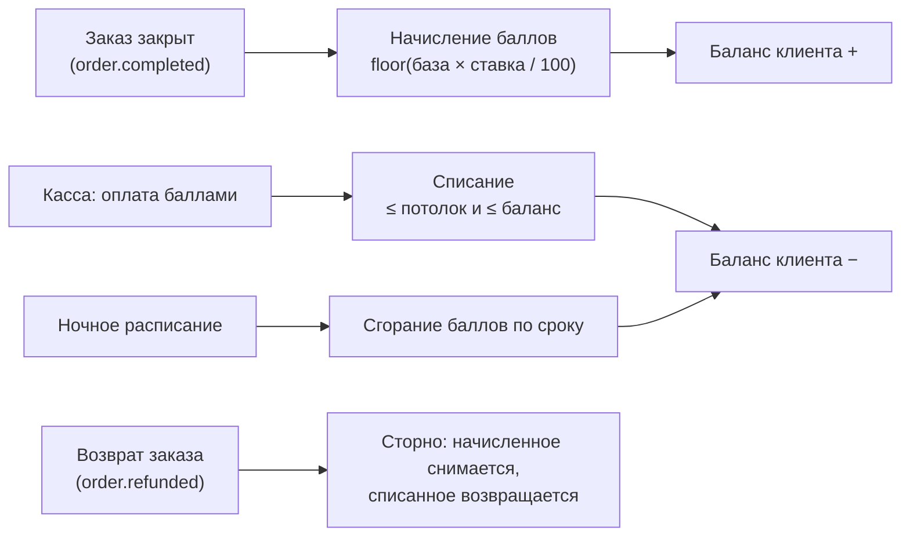
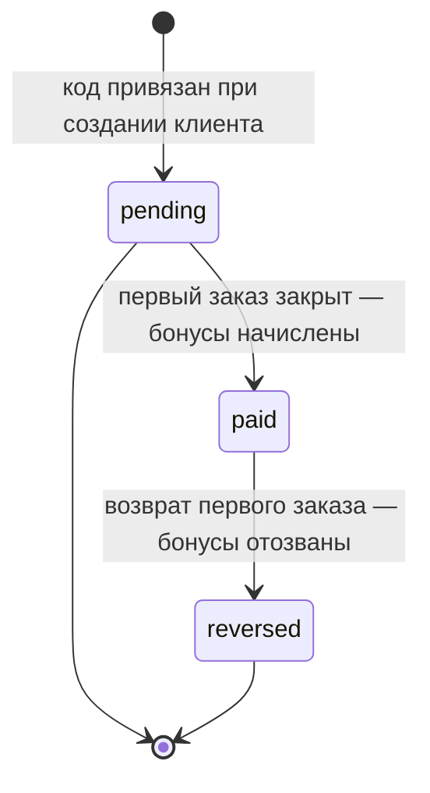

> [!info] Кратко
> Домен **Лояльность** удерживает клиентов тремя механиками: цифровые **штампы «N+1»** (накопил N — получи бесплатный/со скидкой), **кэшбэк-баллы с уровнями** (возврат % от чека баллами, оплата ими части следующего заказа) и **реферальная программа** «Приведи друга». Всё завязано на прикреплённого к заказу клиента: без клиента лояльность не работает. Сервис задеплоен и работает на проде.

## Назначение

Лояльность — отдельный домен платформы (микросервис Loyalty Service, порт 3007). Он вынесен из работы с клиентами и заказами, потому что на **каждом** закрытом заказе создаёт транзакции баллов и счётчиков штампов — это отдельная нагрузка и отдельный релиз-цикл.

Домен хранит балансы баллов, уровни клиентов, счётчики штампов и **журнал всех движений** (для аудита и истории в карточке клиента). Начисления происходят автоматически по событиям заказа, списания — вручную на кассе.

Три программы независимы и могут работать одновременно на одного клиента:

| Программа | Что даёт клиенту | Единица | На что настраивается |
|-----------|------------------|---------|----------------------|
| Штампы «N+1» | Бесплатный товар или скидку после N покупок | Штампы (счётчик) | На товар или категорию, per торговая точка |
| Кэшбэк и уровни | % от чека баллами, оплата баллами | Баллы (1 балл = 1 ₽) | Одна настройка на всю франшизу |
| Реферальная | Бонус баллами приведшему и приведённому | Баллы | Две суммы в общих настройках кэшбэка |

> [!note] Баллы — не деньги, а маркетинговая скидка
> Баллы не отражаются в фискальном чеке при **начислении** (это «после-транзакция», чек уже пробит). При **списании** баллы уходят в чек ККТ как позиция-скидка с тегом 1216 «Премия/скидка» (требование 54-ФЗ). Подробнее про кассу — раздел ниже.

---

## Программа штампов «N+1»

Классическая механика общепита: «6 чашек кофе — 7-я бесплатно». Владелец заводит программу, кассир ничего не считает — штампы начисляются автоматически при оплате с прикреплённым клиентом.

### Как настраивается программа

| Параметр | Значение | Правило |
|----------|----------|---------|
| Область (scope) | Один **товар** или одна **категория** | Задаётся при создании, потом не меняется |
| Цель | Конкретный товар/категория | — |
| Порог (N) | Число штампов до награды | Целое 1–20 |
| Тип награды | Бесплатный товар / скидка % / скидка ₽ | На одну позицию-цель |
| Срок жизни штампа | Опционально, 1–365 дней | Штамп сгорает, если N дней не было нового. «Не сгорает» — по умолчанию |
| Торговые точки | Минимум одна | Мультиселект из точек владельца |
| Статус | Активна / Отключена | Отключение = soft delete, счётчики сохраняются |

### Ключевые правила

- **Без клиента — нет штампа.** Анонимный заказ штампы не начисляет.
- **Сколько товаров — столько штампов.** Три эспрессо в одном чеке при программе на «Эспрессо» дают 3 штампа.
- **Товар может попасть в несколько программ** — тогда каждая получает свой штамп.
- **Порог нельзя менять**, если хоть у одного клиента уже накоплен штамп по этой программе (иначе ломается логика). Область и цель у активной программы тоже неизменны — нужна новая программа.
- **Один redeem на чек на программу** — за один чек от одной программы можно применить максимум одну награду.
- **Продление срока (rolling)** — каждый новый штамп сдвигает дату сгорания вперёд.
- **Возврат заказа откатывает штампы** — начисленные по возвращённому заказу штампы снимаются; если в нём применяли награду — погашенные штампы возвращаются в счётчик.

### Награда

Когда счётчик достигает порога — на кассе становится доступна награда. При применении система рассчитывает цену приза:

- **Бесплатный товар** — цена позиции-цели становится 0 (скидка = полная цена);
- **Скидка %** — процент от цены позиции-цели;
- **Скидка ₽** — фиксированная сумма (не больше цены товара).

Применение награды списывает `N` штампов из счётчика.

---

## Бонусы и уровни (кэшбэк)

Клиент получает **процент от чека баллами**, затем оплачивает баллами часть следующего заказа. Уровни (например Silver / Gold / Platinum) повышают ставку начисления для активных клиентов. **Одна настройка на всю франшизу.**

### Настройки франшизы

| Параметр | Смысл | По умолчанию |
|----------|-------|--------------|
| Ставка начисления | Сколько % чека возвращается баллами | 3 % |
| Потолок списания | Какую max долю чека можно оплатить баллами | 30 % |
| Срок жизни баллов | Через сколько дней неактивные баллы сгорают | 180 дней |
| Приветственный бонус | Баллы при регистрации клиента | 0 (выкл.) |
| Исключения | Категории и товары без начисления (например алкоголь) | нет |

### Уровни

- До **3 уровней** на франшизу (либо ни одного — тогда все на базовой ставке).
- У каждого уровня — **порог суммы покупок за 90 дней** (скользящее окно) и своя ставка начисления.
- Пороги должны возрастать. Ставка уровня заменяет базовую ставку.
- Уровень пересчитывается **раз в сутки по расписанию** (ночью): для каждого клиента берётся сумма закрытых заказов за последние 90 дней, выбирается максимальный уровень с подходящим порогом. При смене — фиксируется новый уровень.

### Начисление, списание, сгорание

- **Начисление** при закрытии заказа: `база × ставка ÷ 100`, округление **вниз**. База считается по сумме заказа.
- **Списание** на кассе: максимум = меньшее из (баланс клиента; потолок % от суммы заказа). Списать больше нельзя.
- **Сгорание** по сроку жизни — ночное расписание создаёт транзакцию сгорания и уменьшает баланс.
- **Сторно при возврате** — все начисления по возвращённому заказу отменяются, все списания возвращаются на баланс. Повторная обработка того же события ничего не делает (защита от дублей).
- **Ручная корректировка** — сотрудник с правом может изменить баланс (±) с обязательным указанием причины (например компенсация по жалобе).

> [!tip] Приветственный бонус
> Даётся один раз при создании клиента, если сумма в настройках больше 0. Как и обычные баллы, имеет срок сгорания.

---

## Реферальная программа

«Приведи друга»: у каждого клиента есть **пожизненный реферальный код** (6 символов). Друг называет код при создании аккаунта на кассе, и когда друг сделает **первый закрытый заказ** — оба автоматически получают бонус баллами.

Механика работает офлайн через кассира: код виден в карточке клиента и на кассе, отдельного мобильного приложения не требуется.

### Как это устроено

| Шаг | Что происходит |
|-----|----------------|
| 1. Код | Генерируется каждому клиенту при создании. Уникален внутри франшизы, неизменяем |
| 2. Привязка | При создании нового клиента на кассе кассир вводит код пригласившего. Привязка возможна **только до первого заказа** и устанавливается **один раз** |
| 3. Выплата | При первом закрытом заказе приглашённого — оба получают бонус баллами (суммы из настроек) |
| 4. Возврат | Если первый заказ возвращают — бонусы отзываются у обоих; повторно программа по этому клиенту уже не срабатывает |

### Правила

- Суммы бонусов задаются в настройках кэшбэка: **бонус пригласившему** и **бонус приглашённому** (по умолчанию 0 = программа выключена, но коды всё равно генерируются).
- **Нельзя пригласить самого себя** и **нельзя привязать код из другой франшизы**.
- **One-shot** — одна пара «пригласивший + приглашённый» регистрируется один раз; после возврата первого заказа выплата не повторяется.
- Реферальные баллы попадают в общий баланс и влияют на расчёт уровня, как и любые начисления.
- Программы независимы: приветственный бонус, обычный кэшбэк и реферальный бонус — три отдельные транзакции; штампов реферал не даёт.

Статус привязки проходит через состояния:

---

## Применение на кассе

Лояльность видна кассиру только после **прикрепления клиента к заказу** (см. [[Клиенты]], [[POS Desktop]]).

1. **Прикрепление клиента** — касса запрашивает у сервиса «превью»: текущий баланс баллов, уровень, лимит списания и доступные награды-штампы на этой точке.
2. **Бейдж в чеке** — показывает уровень, имя, баланс и прогресс по штампам (например «Silver · Иван И. · 320 ₽ · 4/6 эспрессо»), а также реферальный код клиента (кассир может продиктовать).
3. **Награда-штамп** — если счётчик заполнен, появляется плашка «Доступна награда»; по кнопке «Применить» в чек добавляется позиция-приз со скидкой.
4. **Списание баллов** — на экране оплаты поле «Списать баллов» с подсказкой максимума (потолок). Списанные баллы уходят в чек ККТ позицией-скидкой с тегом 1216.
5. **Закрытие заказа** — начисление баллов и штампов происходит **после** оплаты, по событию о закрытии заказа (асинхронно).

> [!important] Порядок применения скидок на кассе
> Ручные скидки → промо-акции → списание баллов (последним). Начисление кэшбэка в чеке не отражается.

---

## Роли и доступ

Доступ — через права (permissions), а не через фиксированные роли (см. [[Роли и доступ]]). Системная роль «Администратор» получает все перечисленные права автоматически.

| Право | Что разрешает |
|-------|---------------|
| `loyalty.read` | Просмотр программ, настроек, уровней, карточек клиентов лояльности |
| `loyalty.programs.manage` | Создание / редактирование / отключение программ штампов |
| `loyalty.settings.edit` | Редактирование настроек кэшбэка и управление уровнями (включает чтение) |
| `loyalty.balance.adjust` | Ручная корректировка баланса баллов клиента |
| `pos.loyalty.apply` | Списание баллов клиента на кассе при оплате |
| `pos.loyalty.redeem_stamp` | Применение награды-штампа на кассе |

**Scope (какие данные видит сотрудник)** считается по владению юрлицами и назначенным точкам: владелец франшизы — вся франшиза; владелец партнёра — свои клиенты и точки; обычный сотрудник — в рамках своих прав и точек. Реферальная программа **своих прав не вводит** — использует права работы с клиентами и настройками кэшбэка.

---

## Связи с другими доменами

| Домен | Связь |
|-------|-------|
| [[Заказы]] | Начисление баллов и штампов — по событию о закрытии заказа; сторно — по событию возврата. Ночной пересчёт уровней берёт суммы заказов за 90 дней |
| [[Клиенты]] | Лояльность привязана к клиенту; реферальный код и факт первого заказа хранятся на стороне клиента. Без клиента лояльность не работает |
| [[POS Desktop]] | Прикрепление клиента, превью баллов/наград, списание, применение штампа |
| Каталог | Товары и категории — цели программ штампов и исключения кэшбэка; цена товара-приза для расчёта награды |
| PayKeeper (касса) | Списание баллов уходит в фискальный чек как скидка с тегом 1216 |
| [[Админка]] | Настройки кэшбэка, уровни, CRUD программ штампов, карточки клиентов лояльности |

---

## Ограничения и открытые вопросы

> [!warning] Расхождение спека↔код
> Два правила из спеки на текущем срезе кода **работают не полностью** — важно для приёмки и обещаний бизнесу:
> 1. **Исключения из начисления не применяются.** В настройках кэшбэка можно указать категории/товары без начисления (например алкоголь), но фактически база начисления = **полная сумма заказа**. Причина: событие о закрытии заказа не передаёт цены и категории позиций. Настройка в интерфейсе есть, эффекта пока нет.
> 2. **Штампы по «категории» фактически не начисляются.** Категория позиции не приходит в событии заказа, поэтому срабатывают только программы штампов на **конкретный товар**. Программы на категорию заработают после расширения события заказа.
>
> Обе проблемы — про недостающие поля в событии заказа (цена, категория позиции). Помечены в коде как TODO.

**Открытые вопросы и осознанные упрощения (вне MVP):**

- **Скидки в базе начисления.** Спека предполагает начисление по сумме после применённых скидок; фактически берётся общая сумма заказа. Требует уточнения при доработке события заказа.
- **Пересчёт уровней — раз в сутки.** Уровень обновляется ночным расписанием, а не сразу после заказа — возможна задержка до суток. Переход на мгновенный пересчёт отложен.
- **Уведомления клиенту** (смена уровня, сгорание баллов, начисление реферального бонуса) — нет: требуется сервис уведомлений.
- **Клиентский интерфейс реферала** (где клиент сам видит код и статистику) — нет: клиентские приложения ещё не созданы. Пока код показывается кассиру и в админке.
- **Anti-fraud и лимиты на рефералов** (защита от накрутки через фейковые аккаунты) — отложено.
- **Кошельки Apple/Google Wallet**, семейные и мультитоварные карты штампов — отложено.

---

> [!note] Сверено с кодом
> `erp-loyalty-service` · ветка `main` · срез `3b70a09` (2026-06-26). Три программы (штампы, кэшбэк/уровни, реферальная), правила начисления/списания/сторно, лимит 3 уровней, скользящее окно 90 дней, ночные расписания сгорания и пересчёта, набор прав и события — **подтверждены в коде**. Сервис задеплоен (есть боевой и тестовый деплой-процессы; отметки «не задеплоен» в старых доках устарели). Расхождения: не применяются исключения из начисления и штампы по категориям (оба — из-за неполного события заказа) — см. блок выше.
