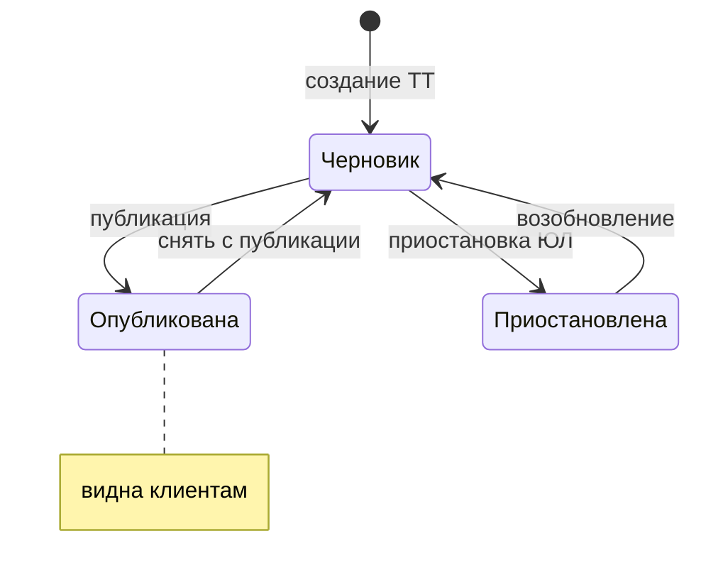
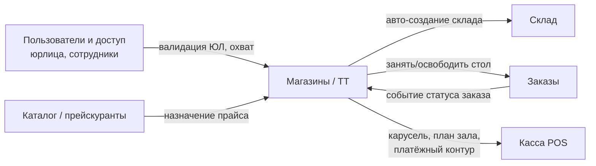

> [!info] Кратко
> Домен **«Магазины»** (Store Service) ведёт торговые точки сети — их карточки, расписание работы, публикацию для клиентов и физическую инфраструктуру внутри точки (кассы, столы зала). Торговая точка — базовая единица, к которой привязываются сотрудники, прейскуранты и склад. Зоны доставки и расчёт ETA пока **не реализованы**.

## Назначение

**Торговая точка (ТТ)** — это конкретное заведение сети (кафе, точка выдачи, ресторан) с адресом, координатами и графиком работы. Домен отвечает за:

- Ведение карточек ТТ: создание, редактирование, удаление, привязка к юридическому лицу (см. [[Пользователи и доступ]]).
- **Публикацию** ТТ — делает её видимой клиентам (сайт, приложение, агрегаторы).
- Расписание работы по дням недели.
- Физическую инфраструктуру внутри точки: **кассы (POS-терминалы)** и **столы зала** для обслуживания «в зале» (dine-in).
- **Платёжный контур** точки — какое кассовое и платёжное оборудование обслуживает ТТ.
- Маркетинговую карусель на экране кассы в режиме простоя (standby).

ТТ — «якорь» всей платформы: к ней привязаны склад (один склад на точку), прейскурант, сотрудники со своими ролями, заказы. Подробнее о месте домена в системе — [[Карта платформы]], бизнес-словарь — [[Глоссарий]], общий обзор — [[Обзор]].

## Ключевые сущности

**Торговая точка** — основная карточка. Бизнес-атрибуты:

| Атрибут | Смысл для бизнеса |
|---|---|
| Название | Имя точки. Уникально в рамках одного юрлица (две ТТ одного ЮЛ не могут называться одинаково). |
| Адрес | Полный адрес точки (обязателен). |
| Координаты (широта/долгота) | Гео-позиция на карте. Проверяются на корректность (широта −90…90, долгота −180…180). Пока используются только как справочные — расчётов на их основе нет. |
| Город, телефон, e-mail | Контактные и справочные поля (необязательны). |
| Юридическое лицо | На кого оформлена точка. **Неизменяемо** после создания — «переселить» ТТ в другое ЮЛ нельзя. |
| Статус | `active` (работает) или `suspended` (приостановлена). |
| Признак публикации | Опубликована ли ТТ для клиентов (да/нет). |
| Прейскурант | Какой прайс-лист действует в точке. Если не задан — берётся прейскурант сети по умолчанию. |
| Часовой пояс | По умолчанию `Europe/Moscow`. Нужен для корректной трактовки расписания. |
| Параметры простоя кассы | Через сколько секунд бездействия кассы включается маркетинговая карусель и как быстро листаются слайды. |

**Виртуальные статусы для интерфейса.** Внутри хранятся два независимых поля (статус + признак публикации), но пользователю показываются три понятных состояния:

| Состояние в UI | Что значит |
|---|---|
| **Черновик** | Точка активна, но ещё не опубликована — клиенты её не видят. |
| **Опубликована** | Точка активна и видна клиентам. |
| **Приостановлена** | Точка заморожена (обычно из-за приостановки её юрлица). Опубликовать нельзя. |

> [!note] Приостановка юрлица снимает точки с публикации
> Когда юрлицо приостанавливают, все его ТТ автоматически снимаются с публикации. Приостановленная точка не может быть одновременно опубликованной.

**Вложенные сущности точки:**

| Сущность | Что это | Ключевые свойства |
|---|---|---|
| **Расписание работы** | График по 7 дням недели | На каждый день — время открытия/закрытия либо отметка «выходной». Допускается работа «через полночь». |
| **POS-терминал (касса)** | Физическое кассовое устройство на точке | Метка («Касса 1»), заводской номер фискального накопителя (**уникален глобально по всей платформе**), регистрационный номер ККТ, статус, отметка последней активности. Заводской номер после привязки не меняется. |
| **Стол зала** | Место в зале для обслуживания «в зале» | Номер (уникален в точке), метка, вместимость, позиция на визуальной карте зала, статус (`свободен`/`занят`/`забронирован`), привязка к текущему заказу, официанту и брони. |
| **Маркетинговый слайд** | Картинка для карусели на экране кассы в простое | Изображение (jpg/png/webp), заголовок, порядок, активность. Управляется маркетологом из админки. |
| **Платёжный контур** | Профиль платёжного оборудования точки (1 на ТТ) | Режим работы кассы: через партнёра PayKeeper либо через связку АТОЛ + терминал P8 Bio. Настраивается отдельным шагом в карточке ТТ, не при создании. |

> [!note] Жизненный цикл столов частично автоматизирован
> Стол занимается при оформлении заказа в зале и освобождается кассиром вручную («Гость ушёл») либо автоматически — при **отмене** заказа. Бронь стола снимается автоматически по истечении времени брони (проверка примерно раз в минуту).

## Зоны доставки и ETA

> [!warning] Зоны доставки и расчёт ETA в домене «Магазины» пока не реализованы
> В карточке ТТ хранятся только гео-координаты (широта/долгота) как справочное поле. **Полигонов зон доставки, радиуса доставки и расчёта времени до клиента (ETA) в домене нет** — ни данных, ни логики. В плановом описании домена значится «в будущем — зоны доставки, авто-увеличение ETA при загрузке», но на текущем срезе кода это отсутствует.

Что это означает для бизнес-аналитика на сегодня:

- **Проверить «попадает ли адрес клиента в зону доставки» этот домен не может** — нет самих зон.
- **Обещанное клиенту время доставки** формируется не здесь. Время готовности и доставки, а также стоп-листы и меню для внешней доставки живут в домене [[Агрегаторы доставки]].
- Координаты точки могут быть использованы будущей логикой (расчёт расстояния, ETA), но пока это только атрибут на карте.

Любые требования по зонам/ETA следует трактовать как **новую функциональность**, а не доработку существующей.

## Роли и доступ

Точка — это **единица разграничения доступа** (scope). Права сотрудника считаются не по «должности», а по набору назначенных ему ролей и по тому, какие ТТ ему доступны. Детальная модель — [[Роли и доступ]] и [[Пользователи и доступ]].

Область видимости сотрудника определяется одним из трёх типов охвата:

| Охват | Что видит сотрудник | Типичный носитель |
|---|---|---|
| **Вся франшиза** | Все ТТ сети | Владелец бренда |
| **Свои юрлица** | Только ТТ своих юрлиц | Партнёр-франчайзи |
| **Назначенные точки** | Только те ТТ, куда его назначили | Менеджер, кассир, официант |

Доступ к операциям над ТТ проверяется по правам (а не по названию роли):

| Право | Что разрешает |
|---|---|
| `stores.read` | Смотреть список и карточки ТТ (в пределах своего охвата). |
| `stores.edit` | Создавать, редактировать, публиковать/снимать с публикации, удалять ТТ. |
| `marketing.read` / `marketing.write` | Просматривать / управлять маркетинговыми слайдами точки. |
| `integrations.manage` | Менять режим платёжного контура точки. |

Управление точками ведётся из [[Админка|админки]] (раздел «Магазины»).

> [!note] О названиях ролей в старых документах
> В части технических спек ещё встречаются старые названия ролей (Franchise / Franchisee / Manager / Cashier). Это лишь удобное сокращение: в системе они давно заменены на модель «права + охват», описанную выше. Ориентироваться нужно на права и охват.

## Связи с другими доменами

| Домен | Характер связи |
|---|---|
| [[Пользователи и доступ]] | ТТ привязана к юрлицу; охват сотрудника и его права определяют доступ к точке. |
| **Склад** | При создании ТТ автоматически заводится её склад (один склад на точку). |
| **Каталог** | Точке назначается прейскурант; без явного — действует прайс сети по умолчанию. |
| **Заказы** | Заказ «в зале» занимает стол; отмена заказа освобождает стол. Точка — обязательный контекст любого заказа. |
| **Касса (POS)** | Касса получает план зала, маркетинговую карусель и профиль платёжного контура точки; кассы регистрируются как POS-терминалы ТТ. |
| [[Агрегаторы доставки]] | Внешняя доставка (меню, стоп-листы, ETA) — отдельный домен; «Магазины» дают только карточку и координаты точки. |

## Ограничения и открытые вопросы

- **Зоны доставки и ETA отсутствуют** — см. раздел выше. Это плановая, ещё не начатая функциональность.
- **Автоосвобождение стола — только при отмене заказа.** Закрытие/выдача заказа стол не освобождает: гость может остаться сидеть, поэтому кассир снимает стол вручную. Формулировку «освобождение при закрытии/отмене» в технической спеке событий следует читать как «при отмене (авто) либо вручную».
- **Проверка разрешения картинки слайда (≥ 1280×720) описана, но не реализована** — слайд меньшего размера будет принят.
- **Уведомления другим доменам о жизни ТТ пока синхронные/точечные.** События «ТТ создана/опубликована/снята/удалена» запланированы, но ещё не публикуются — потребители (например, клиентское приложение) появятся позже.
- **Часовой пояс точки хранится, но расписание** трактуется потребителями; централизованной проверки «открыта ли сейчас точка» на стороне домена нет — это ответственность потребителя расписания.

---
> [!note] Сверено с кодом
> `erp-store-service` · ветка `main` · срез `085275a` (2026-06-30). Атрибуты ТТ, статусы публикации, расписание, POS-терминалы, столы зала и платёжный контур сходятся со спекой vault. Расхождения: (1) **зоны доставки и ETA в коде отсутствуют** (в спеке помечены как «будущее»); (2) автоосвобождение стола срабатывает **только при отмене** заказа, тогда как спека событий говорит «при закрытии/отмене».
