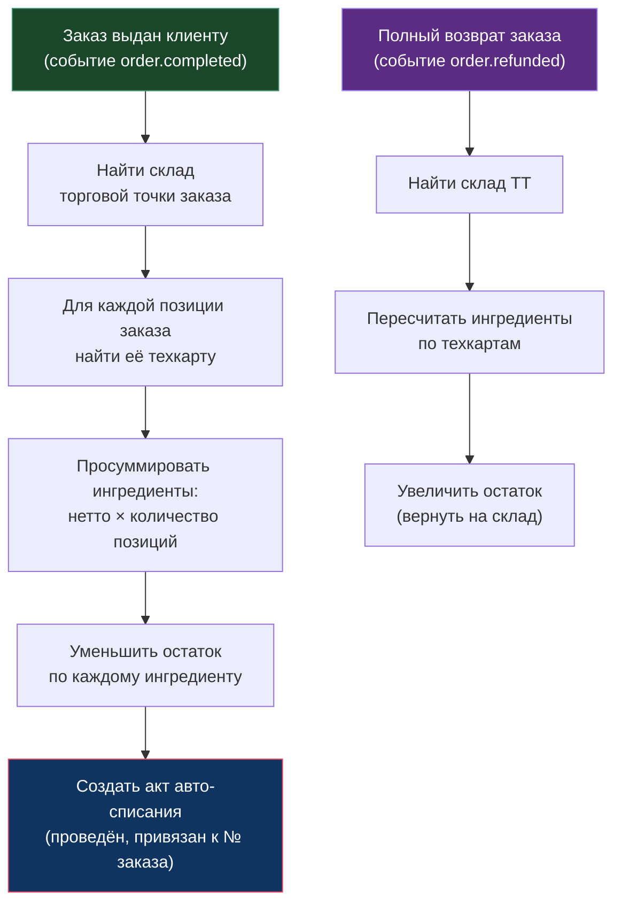

> [!info] Кратко
> «Склад» отвечает за товароучёт франшизы: справочник ингредиентов, техкарты (рецептуры блюд), складские остатки по каждой торговой точке и их автоматическое движение. Когда заказ выдан клиенту, система сама списывает ингредиенты по рецептуре; при поступлении товара — приходует партии и считает среднюю закупочную цену.

## Назначение

Домен ведёт учёт **сырья** (ингредиентов), а не готовых товаров-для-продажи (те живут в [[Каталог]]). Его задачи:

- хранить **рецептуры** (техкарты) — из чего и в каком количестве состоит каждое блюдо;
- вести **остатки** ингредиентов на складе каждой торговой точки (ТТ);
- **приходовать** поступления (акты приёмки) и **списывать** расход (акты списания);
- **автоматически списывать** ингредиенты по рецептуре в момент продажи заказа и **возвращать** их при полном возврате;
- считать **себестоимость** блюда по средней закупочной цене ингредиентов.

Один склад привязан к одной торговой точке и создаётся автоматически при её создании.

## Ключевые сущности

| Сущность | Что это | Ключевое |
|----------|---------|----------|
| **Ингредиент** | Единица сырья франшизы (мука, сыр, стакан) | Имеет базовую единицу измерения; уникален по названию внутри франшизы |
| **Техкарта (рецептура)** | Состав одного блюда: какие ингредиенты и сколько | Привязана либо к товару каталога, либо к ингредиенту-полуфабрикату |
| **Строка рецепта** | Один ингредиент внутри техкарты | Масса брутто/нетто, % потерь, единица, порядок |
| **Техкарта модификатора** | Рецептура добавки (доп. сыр, сироп) | Хранится, но **не участвует** в списании и себестоимости |
| **Склад** | Точка хранения остатков | Один на торговую точку |
| **Партия** | Поступившая порция ингредиента с ценой и датой | Основа для списания «первым пришёл — первым ушёл» и срока годности |
| **Остаток** | Текущее количество ингредиента на складе | Хранит средневзвешенную закупочную цену |
| **Акт приёмки** | Документ поступления сырья | Черновик → проведён; при проводке создаёт партии |
| **Акт списания** | Документ расхода/порчи | Черновик → проведён; при проводке списывает партии |
| **Конвертация единиц** | Справочник «1 упаковка = 500 г» | Справочная запись (см. [[#Ограничения и открытые вопросы|ограничения]]) |

## Техкарты и рецептуры

**Техкарта** — это рецептура: перечень ингредиентов и их количеств, из которых готовится одна порция блюда. У техкарты есть **выход** — вес или объём готового блюда (например, 300 г) и единица выхода.

Каждая техкарта привязана **ровно к одному** из двух:

- к **товару из каталога** — обычная техкарта блюда (например, «Бургер»);
- к **ингредиенту** — техкарта **полуфабриката** (например, «Соус», который сам является ингредиентом для других блюд).

Одновременно и то, и другое указать нельзя — это взаимоисключающие варианты.

### Строка рецепта

Каждая строка техкарты описывает один ингредиент:

| Поле | Смысл для бизнеса |
|------|-------------------|
| **Брутто** | Масса ингредиента до обработки (как со склада) |
| **Нетто** | Масса после обработки (чистки, разморозки) — именно она идёт в блюдо |
| **% потерь (холод/горячая)** | Справочные потери при обработке |
| **Единица измерения** | г, кг, мл, л, шт |
| **Порядок** | Сортировка в карточке рецепта |

> [!important] Что реально движет расходом — нетто
> При автосписании и расчёте себестоимости используется **масса нетто**. Брутто и проценты потерь хранятся как справочная информация технолога, но в автоматические расчёты не подставляются.

**Правило:** нетто не может превышать брутто — система отклонит такую строку.

### Полуфабрикаты и защита от циклов

Полуфабрикат — это ингредиент, у которого есть **собственная техкарта**. Он может входить в рецептуру других блюд как обычный ингредиент. Система запрещает **циклические** рецептуры: нельзя добавить в техкарту полуфабриката ингредиент, который (прямо или через цепочку) уже требует этот же полуфабрикат.

### Себестоимость блюда

Себестоимость считается по запросу: для каждого ингредиента рецепта берётся его **средневзвешенная закупочная цена** на складе и умножается на массу нетто; результаты суммируются.

- Если по какому-то ингредиенту нет данных о цене (не было поступлений) — по нему выдаётся **предупреждение**, а итоговая себестоимость не рассчитывается как полная.
- Полуфабрикаты в рецепте помечаются отдельно (флаг «полуфабрикат»).
- **Модификаторы не учитываются** в себестоимости заказа.

## Списание и остатки

Остаток каждого ингредиента хранится **отдельно на каждом складе** и обновляется тремя способами: приёмка, ручное списание, автоматическое движение по заказу.

### Приёмка (поступление)

Акт приёмки проходит стадии **черновик → проведён**. При проводке для каждой строки:

- создаётся **партия** с закупочной ценой, количеством, датой поступления и (опционально) сроком годности;
- увеличивается остаток ингредиента;
- пересчитывается **средневзвешенная** закупочная цена (по всем непустым партиям).

### Ручное списание

Акт списания (порча, инвентарная недостача) тоже проходит **черновик → проведён**. При проводке количество списывается по методу **FIFO** — «первым пришёл, первым ушёл»: сначала расходуются самые старые партии.

> [!important] Нехватка остатка при ручном списании
> Если партий не хватает для запрошенного количества — проводка отклоняется (ошибка «недостаточно остатка»), акт остаётся черновиком, остаток не уходит в минус.

### Автоматическое движение по заказу

- **Продажа ([[Заказы|order.completed]]):** по техкарте каждой позиции считается расход ингредиентов (нетто × количество) и остаток уменьшается. Создаётся служебный акт авто-списания, привязанный к номеру заказа — для прослеживаемости.
- **Возврат ([[Заказы|order.refunded]]):** ингредиенты возвращаются на склад **только при полном возврате**. Частичные возвраты складом пока игнорируются.
- Если ни у одной позиции заказа нет техкарты — движения склада не происходит (это норма для товаров без рецептуры, например штучной упаковки).
- **Защита от двойного списания:** повторная доставка одного и того же события заказа (техническая особенность очереди) не спишет склад дважды — каждое событие обрабатывается однократно.

> [!warning] Расхождение спеки и кода: автосписание по заказу идёт не через партии
> Спека описывает автосписание по заказу как **FIFO по партиям** с проверкой «недостаточно остатка». В коде автосписание (и авто-возврат) корректирует **только сводный остаток** ингредиента, **не расходуя партии** и **без проверки на нехватку**. Практические следствия:
> - остаток по заказу **может уйти в отрицательное значение**, если по факту сырья не хватило (ошибка не выбрасывается, в отличие от ручного списания);
> - после автосписания/авто-возврата сумма по партиям и сводный остаток могут **разойтись** (партии не трогаются);
> - себестоимость строки авто-акта берётся из текущей средней цены (может быть нулевой, если поступлений не было).
> FIFO с проверкой остатка гарантированно работает только для **ручных** актов списания.

## Роли и доступ

- **Мультитенантность.** Все данные склада привязаны к франшизе; сотрудник видит только данные своей франшизы (определяется по токену авторизации). Подробнее — [[Роли и доступ]].
- **Кто работает со складом.** Ведение ингредиентов, техкарт, приёмок и списаний — back-office операции в [[Админка|Админке]] (владелец франшизы/партнёра и уполномоченные сотрудники в рамках их торговых точек).
- **Служебные операции.** Автоматическое создание склада при создании ТТ и автосписание по заказу выполняются системой (межсервисные вызовы защищены служебным токеном, авто-акты создаются от «системного» пользователя).

> [!note] Точный перечень permission-прав склада
> В коде склада права разграничиваются на уровне франшизы (scope), отдельного каталога permission-строк именно для складских операций здесь не выделено. Актуальная матрица прав — в [[Роли и доступ]] и [[Админка]].

## Связи с другими доменами

| Домен | Связь |
|-------|-------|
| [[Каталог]] | Техкарты и техкарты модификаторов ссылаются на товары и опции модификаторов каталога. Ссылки хранятся как идентификаторы, названия подтягиваются по запросу |
| [[Заказы]] | Источник событий «заказ выдан» и «заказ возвращён» — триггеры автосписания и авто-возврата ингредиентов |
| Торговые точки (Store Service) | Склад создаётся один на торговую точку; остатки и документы привязаны к ТТ |
| [[Админка]] | Пользовательский интерфейс складского учёта: ингредиенты, техкарты, остатки, акты |

## Ограничения и открытые вопросы

- **Модификаторы не списываются.** Техкарты модификаторов ведутся, но добавки не уменьшают остаток и не входят в себестоимость заказа (в событии продажи нет данных о модификаторах). Себестоимости для техкарты модификатора нет.
- **Частичный возврат не восстанавливает склад** — возвращаются ингредиенты только при полном возврате заказа.
- **Конвертация единиц — только справочник.** Записи «1 упаковка = 500 г» хранятся, но **не применяются автоматически** в списании и расчёте себестоимости: количества считаются в единицах, указанных в строке рецепта.
- **Проценты потерь (холодная/горячая обработка)** хранятся как справочная информация и в автоматические расчёты не подставляются.
- **Единицы измерения — свободный текст** (г, кг, мл, л, шт, порция); единого жёсткого справочника единиц на уровне склада нет, консистентность на совести технолога.
- **События склада наружу не публикуются.** Домен только слушает события заказа; собственные уведомления (о приёмке/списании) запланированы, но пока не отправляются.
- **Не реализовано (Phase 2+):** инвентаризация, перемещения между ТТ, справочник поставщиков, авто-рекомендация заказа, восстановление склада при частичном возврате.

---
> [!note] Сверено с кодом
> `erp-warehouse-service` · ветка `main` · срез `ddc55d6` (2026-06-26). Сущности, техкарты, ручное FIFO-списание, приёмка, расчёт себестоимости и защита от двойной обработки событий — совпадают со спекой. Расхождение: автосписание/авто-возврат по заказу корректируют сводный остаток напрямую (без FIFO по партиям и без проверки на нехватку) — см. предупреждение в разделе «Списание и остатки». Спека событий устарела в части идемпотентности (защита от двойного списания в коде уже есть).
