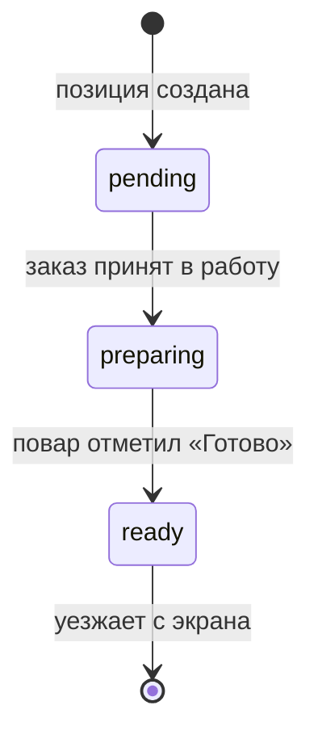

> [!info] Кратко
> **KDS** (Kitchen Display System, «кухонный экран») — отдельное приложение на планшете для кухни или бара. Заменяет бумажные кухонные чеки: повар видит «свои» заказы, отмечает готовность блюд и закрывает станцию, после чего кассир может подать заказ гостю. Статус — **bootstrapped**: все экраны собраны, работает на тестовом контуре, но в продакшн не выведен.

## Назначение

KDS убирает с кухни бумагу и устные заявки. Кассир пробивает заказ на [[POS Desktop]], после чего блюда автоматически появляются на экране повара — сгруппированные по **кухонным станциям** (цехам: «Горячий цех», «Бар», «Холодный цех» и т.п.). Повар готовит, отмечает позиции готовыми и жмёт «Готово по станции» — заказ уезжает с экрана, а кассир получает сигнал, что можно отдавать гостю.

Ключевые идеи:

- **Один заказ виден только «своим» станциям.** Планшет показывает лишь те блюда, что готовятся на его цехе. Позиции чужих цехов в карточке видны серым — как контекст, без кнопок.
- **Цвет по времени.** У каждого заказа есть ожидаемое время готовности. Карточка зеленеет, желтеет и краснеет по мере приближения и превышения срока — повар с одного взгляда видит, что «горит».
- **Звук на новый заказ.** Новый заказ сопровождается звуком, который повторяется, пока повар не откроет карточку; просрочка — отдельным, более тревожным сигналом.

Приложение ставится на Android-планшет (10–13") на кухне; для разработки собирается и под Windows. Обновляется «по воздуху» через встроенную проверку обновлений — без визита на каждую точку.

## Экраны

В сборке ровно **5 экранов** плюс модальное окно техкарты:

| # | Экран | Что делает |
|---|-------|-----------|
| 1 | **Регистрация устройства** | Первый запуск. Мастер из 3 шагов: вход владельца/менеджера по email+паролю → выбор торговой точки → выбор кухонного цеха, к которому привязывается планшет. |
| 2 | **PIN-логин** | Повар входит по 4-значному PIN. Если планшет уже привязан к цеху — сразу открывается список заказов. |
| 3 | **Список заказов** | Главный экран: карточки заказов с цветом по времени и звуком на новые. |
| 4 | **Карточка заказа** | Позиции сгруппированы по станциям; кнопки «Готово» по позиции и «Готово по станции»; модификаторы, комментарий гостя, кнопка вызова техкарты. |
| 5 | **Настройки** | Громкость и заглушение звука, текущая версия и проверка обновлений, данные сессии, выход и отвязка устройства от точки. |

> [!note] Модалка техкарты
> Рецепт блюда (ингредиенты, инструкция, фото) открывается поверх карточки заказа по кнопке — отдельным экраном не считается.

## Статусы приготовления

У каждой **позиции** заказа есть кухонный статус. Модель простая и однонаправленная:

| Статус | Смысл |
|--------|-------|
| **pending** (ожидает) | Позиция только создана, готовка не начата. |
| **preparing** (в работе) | Заказ принят в работу, блюдо готовится. |
| **ready** (готово) | Повар отметил позицию готовой. |

Правила:

- **Откат запрещён.** Вернуть позицию из «готово» в «в работе» на KDS нельзя — исправление возможно только через отмену/возврат на POS кассиром.
- **«Готово по станции»** — массовая кнопка: активна, когда все позиции этого цеха готовы. Нажатие закрывает станцию, и если других «своих» станций в заказе нет — заказ уезжает с экрана.
- **Автоуход заказа.** Заказ исчезает с экрана, когда все нужные позиции готовы либо заказ переведён в «готов»/«отменён».
- **Отмена.** Если кассир отменяет заказ, пока тот на кухне — звучит сигнал, и карточка убирается с экрана. Данные отменённого заказа сохраняются для аудита в домене [[Заказы]].

> [!warning] Расхождение спеки и текущей сборки — модель статусов
> Бизнес-спека описывает работу с позицией в **два касания**: «В работе» (переводит в *preparing*), затем «Готово» (переводит в *ready*), причём заказ должен появляться на KDS уже принятым кассиром на POS.
> В текущей сборке приготовление начинается **одной кнопкой «Принять заказ»** на весь заказ (все его позиции разом переходят «в работу») прямо на KDS, а по каждой позиции остаётся только «Готово». Отдельной кнопки «В работе» на позицию нет. Кроме того, при отмене карточка просто убирается со звуком — без отдельного красного уведомления «Отменён» на пару секунд, как предполагает спека.

## Роли и доступ

Доступ управляется двумя правами (см. [[Роли и доступ]]):

| Право | Что открывает |
|-------|---------------|
| **`kds.access`** | Вход по PIN в KDS и работа с заказами (менять статусы, закрывать станции). Без него вход запрещён. |
| **`kds.settings.edit`** | Регистрация/отвязка планшета и изменение локальных настроек устройства. |

Ролевая матрица (из бизнес-спеки):

| Действие | Владелец франшизы | Владелец партнёра | Менеджер | Повар / бариста | Кассир |
|----------|:---:|:---:|:---:|:---:|:---:|
| Зарегистрировать / привязать планшет | ✅ | ✅ (свои ТТ) | ✅ | ❌ | ❌ |
| Вход по PIN и работа с заказами | ✅ | ✅ | ✅ | ✅ | ❌ |
| Сменить/отвязать точку устройства | ✅ | ✅ (свои) | ✅ | ❌ | ❌ |

Права и списки цехов настраиваются в [[Админка|Админке]] и приходят на планшет при входе. Проверка `kds.access` при входе выполняется на бэкенде.

> [!warning] Расхождение — привязка к цеху (версия 2)
> Спека делает акцент на **мультивыборе станций** при каждом входе (один планшет может обслуживать сразу «Кухня + Бар»). В коде появилась **вторая версия сценария**: планшет привязывается к **одному** цеху ещё на регистрации, и экран выбора станций после PIN пропускается. Мультивыбор остаётся только как запасной путь для устройств, зарегистрированных до этого изменения. Фактический курс — «один планшет = один цех».

## Техническое состояние (зрелость)

> [!warning] Bootstrapped, не в продакшене
> Собраны все 5 экранов и базовые сценарии, приложение работает на тестовом контуре. Это ранняя стадия (P0 по плану развития), в прод не выведено.

- **Каркас готов:** регистрация, вход, список и карточка заказа, настройки, звуковые/цветовые оповещения, live-обновление заказов.
- **Заглушки в P0:** реальные звуковые файлы пока не заведены (используются простые синтезированные сигналы); подпись пакета обновления и автосборка ещё не настроены.
- **Транспорт:** работает «Облако» (через промежуточный слой POS). Есть демо-режим с тестовыми данными для разработки без сети. Режим «локальная сеть» отсутствует — запланирован на следующую фазу.
- **Хранилище на устройстве** пока держит только конфигурацию планшета; полноценная офлайн-работа с заказами — более поздняя фаза.

Планы развития (серия задач KDS): локальный режим без интернета, полный офлайн, печать кухонных чеков на принтерах, курсы подачи, кнопочная панель (bump bar), английский интерфейс.

## Связи с другими доменами

| Домен | Как связаны |
|-------|-------------|
| [[POS Desktop]] | Источник заказов: кассир пробивает заказ и запускает готовку; получает сигнал «готово к подаче». |
| [[Заказы]] | Кухонные статусы позиций, ожидаемое время готовности, отмены — живут в домене заказов. |
| [[Админка]] | Настройки KDS (звуки, авто-логаут), список устройств, справочник кухонных станций и их цветовые пороги. |
| [[Роли и доступ]] | Права `kds.access` и `kds.settings.edit`. |
| [[Карта платформы]] | Где KDS расположен среди прочих продуктов и сервисов. |
| [[Обзор]] | Общее знакомство с платформой. |

Справочник кухонных станций и техкарты блюд ведутся в каталоге; заказы и статусы — в сервисе заказов.

## Ограничения и открытые вопросы

- **Не в проде.** Всё описанное — раннее состояние; поведение и экраны ещё будут меняться.
- **Только Android (и Windows для разработки).** Сборки под iOS в планах P0 нет.
- **Только русский интерфейс** на текущей фазе.
- **Нет отмены/возврата с кухни.** Финансовые операции остаются на POS у кассира.
- **Настройки франшизы подтягиваются «по запросу»** (при входе, перезапуске, ручном обновлении); мгновенной live-рассылки настроек нет.
- **Расхождения спеки и сборки** по модели статусов, приёму заказа и привязке к цеху (см. предупреждения выше) — требуют сверки бизнес-намерения перед выводом в прод.
- **Открытые вопросы фазы 2** (из архитектурного исследования): нужен ли локальный «хаб» и офлайн-БД, кнопочная панель, принтеры по цехам, разрешение конфликтов при рассинхроне.

---
> [!note] Сверено с кодом
> `erp-kds` · ветка `main` · срез `61ca6ab` (2026-06-09). Подтверждено: ровно 5 экранов, трёхстатусная модель приготовления (ожидает → в работе → готово, без отката), права `kds.access` / `kds.settings.edit`, транспорт «Облако» + демо-режим (локальной сети нет). Расхождения с бизнес-спекой (модель статусов и приём заказа, привязка «один планшет = один цех», отсутствие оверлея отмены) вынесены в предупреждения по тексту.
