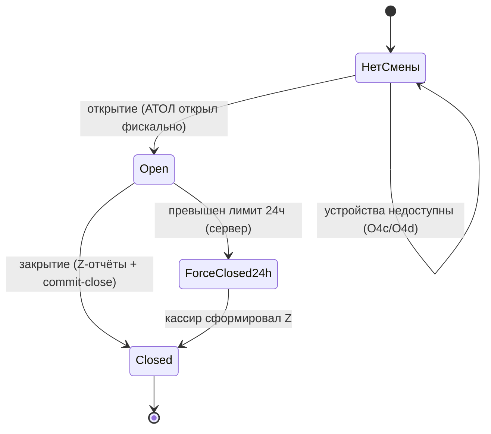

> [!info] Кратко
> POS Desktop — кассовое приложение франчайзи на Windows (технология Tauri: веб-интерфейс в нативной обёртке). Кассир входит по PIN, открывает кассовую смену, собирает заказ, принимает оплату (наличные / карта / СБП) и оформляет возвраты. Оплата и фискализация идут через локальный [[POS Bridge]] к кассе АТОЛ 30Ф и терминалу Р8 Bio. Сейчас кассовая смена перестраивается из «программной» модели в **device-orchestrated** (оркестрация реальными устройствами) — см. раздел «Кассовая смена».

## Назначение

Замена iiko-кассы на торговой точке. Одно устройство = одна касса, жёстко привязанная к торговой точке (ТТ) при регистрации. Через POS проходит весь цикл обслуживания гостя: приём заказа, оплата с печатью фискального чека, возврат, программа лояльности.

Ключевые роли приложения:

| Функция | Что делает |
|---|---|
| Точка входа кассира | Вход по email+пароль (первый раз) и по PIN (далее), проверка права `pos.access` |
| Управление сменой | Открытие/закрытие кассовой смены, X- и Z-отчёты |
| Оформление продажи | Корзина, скидки, прикрепление клиента, отправка заказа на кухню ([[KDS]]) |
| Приём оплаты | Наличные, карта, СБП — через мост к железу либо через [[PayKeeper]] |
| Возвраты | Полный и частичный возврат оплаченного заказа |
| Лояльность | Штампы «N+1», списание баллов, уровни клиента |
| Витрина простоя | Маркетинговая карусель на экране, когда касса не используется |

> [!note] Каналы работы кассы
> Помимо Windows-сборки есть веб-сборка того же интерфейса (за nginx на тестовом стенде). Мобильный Android-клиент **заморожен** — целевой канал кассы — десктоп. Терминология: **мост (bridge)** — локальная программа-посредник между кассой и железом; **эквайринг** — приём безналичной оплаты; **фискализация** — регистрация чека в фискальном накопителе кассы (по 54-ФЗ).

## Кассовая смена

Кассовая смена — рабочий период кассы между открытием и закрытием (по закону — не более 24 часов). Все продажи и возвраты привязаны к открытой смене.

> [!important] Переход на device-orchestrated модель (в работе)
> Раньше смена была «программной»: кассир вручную вводил стартовый нал, а итоги считались в приложении. Сейчас смена перестраивается в **device-orchestrated**: открытие и закрытие — это оркестрация реальных устройств (касса АТОЛ 30Ф + терминал Р8 Bio) с **3-источниковой сверкой** итогов на сервере. Ввод стартового нала убран. На бэкенде раскатка идёт под флагом `pos_device_shift_enabled` (постепенное включение); в текущей сборке кассы новый флоу — основной. Сводный контракт поведения — [[POS — Матрица состояний смены]].
>
> Что значит «3-источниковая сверка»: сервер сверяет итоги смены по трём независимым источникам — наличные из заказов, безналичные из терминала Р8 (по номерам операций RRN) и фискальные данные из накопителя кассы. Расхождения фиксируются в аудит-журнал.

### Открытие смены

Кассир нажимает «Открыть кассовую смену». Мост опрашивает сначала терминал Р8, затем кассу АТОЛ (реальный отчёт открытия смены в фискальном накопителе). Результат зависит от того, какие устройства ответили:

| Ветка | Терминал Р8 | Касса АТОЛ | Итог |
|---|---|---|---|
| O4a | доступен | открыл | Смена открыта штатно |
| O4b | недоступен | открыл | Смена открыта в режиме **«только наличные»** (`cash_only`) — безнал заблокирован |
| O4c | доступен | не открыл | Смена **не открыта** (показан код ошибки кассы) |
| O4d | недоступен | не открыл | Смена **не открыта** (оба устройства недоступны) |

> [!warning] Режим «только наличные» (O4b)
> Если Р8 недоступен, но касса АТОЛ открыла смену фискально — смена работает, но безналичную оплату принять нельзя (единственный канал безнала в bridge-режиме — терминал Р8). Кнопка «Картой» на оплате становится неактивной, продавать можно только за наличные. Флаг восстанавливается с сервера, поэтому переживает перезапуск приложения.

Печать чека открытия: на кассе 30Ф отчёт открытия печатается железом всегда; отдельная нефискальная копия по кнопке требует подписки ИТС (открытый вопрос, см. ниже).

### Закрытие смены

Пошагово: проверка незакрытых заказов → снятие X-отчётов → серверная сверка → формирование Z-отчётов → закрытие.

- **X-отчёт** — промежуточный отчёт без обнуления (снимок текущих итогов смены).
- **Z-отчёт** — итоговый отчёт с закрытием смены в фискальном накопителе (гашение).

1. **Гвард заказов** — если есть неоплаченные/незавершённые заказы, закрытие блокируется со списком.
2. **X-отчёты** снимаются с кассы АТОЛ и терминала Р8, затем сервер выполняет 3-источниковую сверку.
3. **Модалка результата** — по итогам сверки (см. состояния ниже): чисто / расхождения / частичная сверка (Р8 недоступен) / ошибка кассы.
4. **Z-отчёты**: сначала Z-терминала (Р8, гашение банковского батча), затем Z-кассы (АТОЛ, фискальное закрытие). Оба формируются всегда; выбор «печатать/не печатать» управляет только бумагой.
5. **Закрытие**: итоговые суммы берёт **сервер** (агрегация из заказов), клиентским цифрам не доверяет. Если была сверка с расхождениями — пишется аудит-запись (кто/когда/снимок).

> [!note] Отказоустойчивость закрытия
> Если Z-кассы (фискальное закрытие) не удаётся даже после авто-повторов — смена **не закрывается**, кассиру показывается ошибка. Если недоступен только терминал Р8 — закрытие продолжается (Z-терминал помечается «не сформирован»), касса всё равно закрывает смену. Повтор при ошибке кассы дёргает только АТОЛ, не пере-опрашивая устройства заново.

### Отчёты прошлой смены

На экране открытия доступен блок последней закрытой смены: строки Z по устройствам и кнопка «Сохранить PDF» (копия Z-отчёта). Повторная печать Z на 30Ф недоступна без подписки ИТС.

## Оформление заказа и чек

Кассир собирает корзину из товаров каталога, приложение локально считает суммы (цена × количество), применяет скидки и модификаторы. Возможности главного экрана заказа:

- Добавление позиций из каталога ([[Каталог]]), учёт стоп-листа (недоступные позиции).
- Ручная скидка на позицию (в процентах); скидка сверх порога требует подтверждения менеджера (см. ниже).
- Прикрепление клиента (поиск по телефону, быстрое создание) — включает лояльность.
- Работа со столами и разбивка по залу, отправка на кухонный экран [[KDS]].
- Заказы агрегаторов доставки обрабатываются на отдельном экране.

Заказ отправляется на сервер ([[Заказы]]), где агрегируются суммы и скидки. Гвард открытой смены проверяется на бэкенде: если смены нет — приложение ловит это и отправляет кассира на экран открытия.

Фискальный чек печатает касса АТОЛ в момент оплаты (см. ниже). На чеке — фискальные реквизиты: **ФД** (номер фискального документа), **ФП** (фискальный признак), **ФН** (номер фискального накопителя), **РНМ** (регистрационный номер кассы), QR-код для покупателя.

## Оплата

Есть два режима приёма оплаты — приложение выбирает по конфигурации точки:

| Режим | Как платит клиент | Где идёт фискализация |
|---|---|---|
| **PayKeeper** ([[PayKeeper]]) | На своём телефоне по QR/ссылке (invoice) | На стороне PayKeeper |
| **Bridge** (АТОЛ + Р8 Bio) | Прикладывает карту к терминалу Р8 на кассе | На кассе АТОЛ через [[POS Bridge]] |

В bridge-режиме POS ведёт весь UX сам и показывает реальный прогресс операции. Доступные тендеры: **наличные**, **карта**, **СБП** (Система быстрых платежей).

### Оплата картой / СБП (bridge)

Процесс (сага) идёт по шагам, и на каждом кассир видит свой экран:

1. **Ожидание карты** — «Приложите карту к терминалу». Можно отменить (пока карта не одобрена).
2. **Печать чека** — карта одобрена, касса печатает фискальный чек. Отмена уже недоступна (деньги списаны).
3. **Успех** — показаны реквизиты: сумма, способ (Карта/СБП), RRN и код авторизации от терминала, фискальные ФД/ФП/ФН/РНМ. Кнопка «Новый заказ».

> [!note] RRN
> RRN — уникальный номер банковской операции, по которому её можно найти в терминале и банке; используется при сверке и возврате.

Если что-то пошло не так, сага уходит в один из исходов:

| Исход | Что произошло | Что видит кассир |
|---|---|---|
| Отказ | Карта отклонена / не приложена / отменена | «Ошибка платежа. Деньги не списаны». Заказ авто-отменяется |
| Проверка статуса | Связь с терминалом прервалась после отправки — исход неизвестен | «Проверяем статус оплаты…», система сама сверяется с терминалом |
| Отложенная коррекция | Карта списана, но чек не прошёл → авто-возврат сделан | «Платёж отменён автоматически, деньги возвращены», чек коррекции сформируется сам |
| Ручное вмешательство | Карта списана, авто-возврат не удался | «Требуется вмешательство» — возврат вручную через менеджера |

### Оплата наличными (bridge)

В bridge-режиме вместо одной кнопки «Оплатить» — две: «Картой» и «Наличными». При наличных открывается модалка приёма денег: итог, ввод полученной суммы, живой расчёт сдачи. Далее сразу печать фискального чека (шаг эквайринга пропускается — карты нет). На экране успеха — способ «Наличные», «Принято / Сдача», фискальный блок как у карты.

> [!important] Устойчивость оплаты
> Каждая оплата имеет ключ идемпотентности — повтор при обрыве связи не пробьёт чек дважды. Событие «заказ оплачен» публикуется **автоматически** по факту успеха саги (не по клику кассира), с фоновой очередью повторов, если сервер недоступен. Это защищает от «оплатили, но сервер не узнал».

## Возвраты

Возврат оформляется на отдельном экране: слева — список последних оплаченных заказов (поиск по номеру), справа — форма возврата.

- **Полный возврат** — вся сумма заказа.
- **Частичный возврат** — выбор позиций и количества (шаговый счётчик), сумма пересчитывается.
- Указывается причина (опционально). Способ возврата = способ оригинальной оплаты.

Куда идёт возврат:

| Оплата заказа | Как возвращаем |
|---|---|
| Карта (bridge) | Через терминал Р8 (отмена операции или возврат) + чек «возврат прихода» на АТОЛ |
| СБП (bridge) | Только полноценный возврат через Р8 (у СБП нет «отмены») — доступно, если у терминала включена возможность СБП-возврата |
| Наличные (bridge) | Только фискальный чек «возврат прихода», деньги кассир отдаёт из ящика |
| PayKeeper / старые заказы | Облачный путь через адаптер [[PayKeeper]] |

> [!warning] Порог подтверждения возврата
> Возврат на сумму **свыше 1000 ₽** требует подтверждения менеджера по PIN (см. следующий раздел). Ниже порога — оформляется сразу.

Отдельно есть «запросы на возврат от админа» (из [[Админка]]) — кассир видит их списком и подтверждает на кассе.

## Лояльность на кассе

Программа лояльности ([[Лояльность]]) работает после прикрепления клиента к заказу. Поддерживается на трёх точках интерфейса:

1. **Прикрепление клиента** — подгружается превью лояльности: баланс баллов, уровень клиента, лимит списания, прогресс по штампам.
2. **Бейдж в шапке заказа** — уровень (с цветом), баллы, прогресс штампа «N+1» (например, 4/6), реферальный код клиента.
3. **Награда за штампы** — если накоплено достаточно, появляется плашка «Доступна награда» → кнопка «Применить» добавляет позицию-приз в корзину.
4. **Списание баллов** — на оплате модалка «Списать баллов»: доступная сумма = минимум из баланса и лимита (процент от чека). Скидка баллами уходит в чек отдельной строкой.

Права: `pos.loyalty.apply` (списание баллов), `pos.loyalty.redeem_stamp` (награда за штампы). Без прав элементы скрыты. При отсутствии данных лояльности интерфейс тихо деградирует до режима «без лояльности».

## Подтверждение менеджером

Некоторые операции сверх порога кассир не может провести сам — нужен PIN менеджера. Единая модалка подтверждения:

| Операция | Порог | Что требуется |
|---|---|---|
| Возврат | > 1000 ₽ | PIN менеджера |
| Скидка на позицию | сверх максимального «свободного» процента | PIN менеджера |
| Снятие позиции со стоп-листа | — | PIN менеджера |

Менеджер вводит PIN (4–6 цифр) прямо в модалке. Сервер проверяет PIN в рамках заданного разрешения (например, «возврат до N ₽») и возвращает разовый токен-подтверждение, который прикладывается к операции. Ошибочный PIN — сброс и повтор.

## Состояния смены

Статус смены хранится на сервере и опрашивается кассой раз в минуту.

| Статус | Кто ставит | Поведение кассы |
|---|---|---|
| `open` | Открытие смены | Штатная работа |
| `closed` | Закрытие (commit-close) | Локальная смена очищена, переход на «Сотрудники» |
| `force_closed_24h` | Серверный воркёр (54-ФЗ, лимит 24ч) | Баннер + принудительный переход на закрытие: «сформируйте Z, при ошибках — поддержка» |

Развилки открытия (O4a–O4d) и закрытия (чисто / расхождения / частичная сверка / ошибка кассы) описаны выше и полностью — в [[POS — Матрица состояний смены]].

## Связи с другими доменами

| Домен | Связь |
|---|---|
| [[POS Bridge]] | Локальный мост к АТОЛ 30Ф и Р8 Bio: оплата, возврат, X/Z-отчёты, фискализация |
| [[PayKeeper]] | Альтернативный режим оплаты (оплата с телефона клиента) + облачные возвраты |
| [[Заказы]] | Создание заказа, агрегация сумм, гвард открытой смены, история оплат |
| [[Каталог]] | Товары, модификаторы, цены, стоп-лист |
| [[KDS]] | Отправка заказа на кухонный экран |
| [[Лояльность]] | Штампы, баллы, уровни клиента |
| [[Админка]] | Заведение сотрудников/PIN, маркетинговая карусель, запросы на возврат |
| [[Пользователи и доступ]] | Проверка `pos.access` и прочих прав, PIN менеджера |
| [[Роли и доступ]] | Ролевая модель, привязка кассира к ТТ |
| [[OFD]] | Отправка фискальных документов оператору фискальных данных (через кассу) |

Витрина простоя: маркетинговая карусель показывается после заданного времени бездействия (настраивается в [[Админка]]). Любое касание/клик возвращает на рабочий экран.

## Ограничения и открытые вопросы

- **Device-orchestrated смена — в активной перестройке.** На бэкенде раскатка под флагом `pos_device_shift_enabled`. В сборке кассы новый флоу уже основной, но эпик не закрыт (открытие/закрытие, сверка, отчёты дорабатываются на железе).
- **Печать копий чеков открытия/Z на 30Ф** требует подписки ИТС; без неё вместо печати — уведомление/PDF. Итоговое решение (откат авто-печати или ИТС) отложено.
- **СБП-возврат** доступен только при включённой возможности на терминале (у СБП нет «отмены», только полноценный возврат). По СБП частичная отмена не поддерживается — известны UX-нюансы, которые дорабатываются.
- **Мульти-сторовые сотрудники**: кассир может войти только на ту кассу, к ТТ которой он привязан; выбор ТТ при логине не реализован (вход с правильно зарегистрированной кассы).
- **Продажа за наличные через АТОЛ в режиме `cash_only`** (когда Р8 недоступен) — отдельная доработка, поверхностно закрыта, требует проверки на железе.
- **Тонкая проверка прав** (`pos.refunds`, `pos.loyalty.*` на клиенте) частично отложена — сейчас доступ к экранам через роутинг, основная проверка прав на сервере.

---
> [!note] Сверено с кодом
> `erp-pos-desktop` · ветка `feature/cash-shift-device` · срез `fb1f803` (2026-07-07). Экраны, флоу оплаты (карта/наличные/СБП через bridge), возвраты, лояльность, подтверждение менеджером и device-orchestrated смена (открытие O4a–O4d, закрытие через reconcile + commit-close, матрица `shiftStateMatrix`) подтверждены в коде. Расхождения со спеками — в callout-блоках «Расхождение спека↔код» выше по тексту.
>
> **Расхождения спека↔код** (некритичные, зафиксированы для актуализации спек в vault):
> - Спека лояльности POS помечена `status: pending-frontend`, но фронтенд-интеграция **реализована** (бейдж, модалка списания баллов, применение штампов, авто-подгрузка превью).
> - Спека возвратов упоминает guard `RequireShift` на роуте, но в коде он **убран** — открытая смена проверяется на бэкенде (`NO_OPEN_SHIFT`), касса ловит ошибку и редиректит на открытие.
> - Устаревший флаг `pos_device_shift_enabled` в коде десктопа отсутствует — это **бэкенд-флаг** (order-service); на этой ветке кассы device-флоу уже основной.
